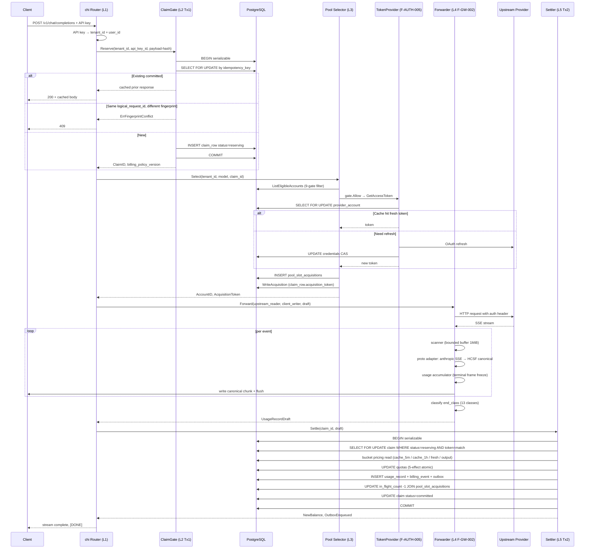

# HUAKAI 融合架构 — 项目逻辑框架

| 字段 | 值 |
| --- | --- |
| Status | **v0.2** — 加入 3-tier 切分 + 5 复杂度轴 + L0/L1/L2 商业路线图 + 实测进度 |
| 作者 | Claude PM-Orchestrator (Opus) |
| 日期 | 2026-04-30 (v0.1: 2026-04-29) |
| v0.2 driver | Owner 2026-04-30 三条纠正：(1) 3-tier 责任切分（Router/Pool/Executor）；(2) "融合怪 = 8 灵魂全部融合，不是 sub2 一家底座"；(3) "拆解还不够"——增加 5 复杂度轴的 mechanism 跟踪 |
| 输入材料 | 21 份独立深度拆解 + 7 个 inventory + 7 份 Released spec + DR-001/002/006/008 + 01_PROJECT_BRIEF + 50 个 Tx2 invariant + 7 条 CMB cross-module invariant + Slice 1+4 落地证据 |
| 形态 | 中文 executive 总览（Part A）+ 可视化 + 5 张表（Part B） |
| 读者 | Owner（决策入口）+ 后续 contributor（执行入口） |
| 当前实测进度 | **加权 ~30%** — money path 70% (Phase B.5/C.4 落地 + commit ce133da) + 治理 100% + Router skeleton 30% (Slice 1) + Obs query 40% (Slice 4) + L0 商业化 0% + 真 upstream 0% |

---

# Part A — 一页中文 executive 总览

## 一句话产品定位

**HUAKAI 是把 8 个开源 AI gateway 项目的灵魂全部融合在一个 PG schema + 一个 binary 里活下来的"融合怪"，主面向"卖 API（自部署）+ 卖 SaaS（卖给别人运营）"双业务模式（DR-002）。**

商业本质：sub2api 给的灵魂是「用 $20/月 Anthropic Pro 订阅跑 API 价的 token 套利」。HUAKAI 卖 SaaS = 代别人跑这个套利 + new-api 的运营壳 + portkey 的成本优化器 + helicone 的透明日志 + litellm 的统一 SDK + envoy 的声明式配置 + one-api 的额度分账，all-api-hub 当反例不抄。

**不是 sub2api fork**，也不是堆 8 个项目的功能清单，是把 8 个项目"分散的灵魂"按统一架构重写成一个产品。

## 顶层架构（3-tier 责任切分，2026-04-30 Owner 定调）

Owner 2026-04-30 quote: "Router 决定应该尝试哪些路线；Resource Pool 决定这条路线下哪个资源现在能 claim；Gateway Executor 负责按 RoutePlan 跑 attempt、claim、forward、settle、fallback。"

```
┌──────────────────────────────────────────────────────────────────┐
│  Inbound HTTP  →  Auth (resolve)  →  Registry (resolve model)    │
│                                          │                        │
│                                          ▼                        │
│  ┌──────────────────┐    ┌─────────────────────┐                  │
│  │  Router Engine   │───▶│  Gateway Executor   │                  │
│  │  Plan(...)       │    │  for each AttemptPlan:                 │
│  │  - cross pool /  │    │    1. Pool.Claim    │                  │
│  │    cross model / │    │    2. Adapter.Forward                   │
│  │    cross cost    │    │    3. Settler.Settle / Refund           │
│  │  - emit          │    │    4. on retryable err → next attempt   │
│  │    RoutePlan     │    └─────────────────────┘                  │
│  └──────────────────┘             │                                │
│        │                          ▼                                │
│        │                  ┌──────────────────┐    ┌──────────────┐│
│        │                  │  Resource Pool   │───▶│   Adapter    ││
│        │                  │  intra-pool 9-gate│   │  upstream/   ││
│        │                  │  权重/冷却/槽位 │   │   client     ││
│        │                  │  Claim → Lease   │   └──────┬───────┘│
│        │                  └──────────────────┘          │        │
│        │                                                ▼        │
│        │                                          Upstream API   │
│        ▼                                                          │
│  ┌──────────────────────────────────────────────────────────────┐│
│  │  Ledger (Reserve / Settle / Refund / RecordAttempt /         ││
│  │          RecordUsage / Abort)                                ││
│  │  Tx1 / Tx2 / append-only 50 invariants                       ││
│  └──────────────────────────────────────────────────────────────┘│
└──────────────────────────────────────────────────────────────────┘
```

**6 公开契约**（[docs/specs/_invariants/cross-module-boundaries.md](specs/_invariants/cross-module-boundaries.md)）:
```go
ResolveInboundAuth(ctx, *http.Request) → RequestContext   // internal/auth
ResolveModel(ctx, publicModel, tenant)  → ResolvedModel   // internal/registry
Plan(ctx, RequestContext, ResolvedModel, RequestFeatures) → RoutePlan  // internal/router
Claim(ctx, AttemptPlan) → Lease                           // internal/pool
Forward(ctx, Lease, NormalizedRequest, w) → UpstreamResult  // internal/proto + pkg/adapter
Reserve / Settle / Refund / RecordAttempt / RecordUsage / Abort  // internal/billing + internal/obs
```

**3-ID 系统** (Owner 2026-04-30 定):
- `request_id` — 一次用户请求，全链路唯一（chi middleware 设最先）
- `attempt_id` — 一次上游尝试（Executor 每次循环 iteration 设；fallback 后多个）
- `lease_id = pool_slot_acquisitions.id` — 一次资源占用（Pool 设）
- `claim_id`（既有）— Tx1 操作 ID
- `acquisition_token`（既有）— **降级为 Internal 防重复释放令牌**，不是业务审计 ID
- 审计链：`request_id → claim_id(s) → attempt_id(s) → lease_id(s) → usage_record(s)`

**7 条 CMB invariant**（[cross-module-boundaries.md](specs/_invariants/cross-module-boundaries.md)）：
- CMB-1: Router 不读凭证；CMB-2: Pool 不算 cost；CMB-3: Adapter 不绕 Ledger
- CMB-4: Ledger 只通过事件结算；CMB-5: Credential 永不进日志
- CMB-6: 三 ID 必须存在；CMB-7: Router 写 0 行，Pool 只写自己槽位行，Ledger 写其他

## 5 复杂度轴（sub2api"抓刀"清单 + 实测进度）

Owner 2026-04-30 quote: "sub2api 核心复杂度集中在'上下文状态 + 渠道调度 + 协议转换 + 计费补偿 + 异步任务'"。HUAKAI 必须在每条轴上吃透 mechanism，不只是功能列表。

| 轴 | sub2api 是怎么做的 | HUAKAI 现状 | % | 关键 spec/code |
|---|---|---|---|---|
| **1. 上下文状态** | 续接 marker / sticky session / 跨账号 fallback | sticky_bindings 表 schema 有；逻辑代码 0 行 | **10%** | F-POOL-001 §Layer 1-2 |
| **2. 渠道调度** | 5 层 routing + 9-gate + claim-gate Pattern B | 9-gate selector + Phase C.2 三 adapter (DBSlotManager / DBClaimGate / DBAccountSource) 已实现 | **60%** | [pool/](../backend/internal/pool/) + Slice 1 router skeleton |
| **3. 协议转换** | OpenAI ↔ Anthropic ↔ Gemini canonical 中介 | 1 个 anthropic_sse upstream adapter；OpenAI client adapter 0；HCSF canonical 类型空 | **15%** | [proto/anthropic_sse.go](../backend/internal/proto/anthropic_sse.go) |
| **4. 计费补偿** | claim-gate Tx1 + 5-effect Tx2 + audit billing event | F-OBS-001 + 50 invariants + Phase B.5 真实 PG + 7 集成测试 + 端到端 smoke | **70%** | [billing/](../backend/internal/billing/) + [F-OBS-001-tx2-invariants-checklist.md](specs/_invariants/F-OBS-001-tx2-invariants-checklist.md) |
| **5. 异步任务** | orphan-sweep / DLQ replay / outbox consumer / token cache invalidation | spec 提名字；实现 0 行 | **0%** | (Phase 4.5 全部) |

**5 轴评分: 1.55/5**。计费补偿吃透；渠道调度中等；其他三轴还浅。下一步重点（按 Slice 2-5）补 1/3，再补 5。

## 8 灵魂融合表（"融合怪" — 不是 sub2 一家底座）

| 项目 | License | 灵魂 | HUAKAI 吸收形态 | 当前 % |
|---|---|---|---|---|
| **sub2api** | LGPL-3.0 | OAuth 套利核心：登录 bootstrap + refresh + Claude Code mimicry + 5h window | F-AUTH-005 spec 有；refresh/mimicry/bootstrap 实现 0；登录 bootstrap 是 L0 必须 | **5%** |
| **one-api** | MIT (anchor) | 多租户 + channel + 额度包分账 + 2-gate auto-disable | tenant + channel schema 有；额度包 0；auto-disable 0；分账 0 | **25%** |
| **new-api** | AGPL-3.0 | 充值订单 + 邀请码 + 礼品卡 + admin 面板 + 缓存差价计费 + reasoning effort 透传 | 全 0（Phase 4 stub admin endpoints 14 个全 501） | **0%** |
| **portkey** | MIT | Gateway as cost optimizer：fallback / retry / load balance / cache / virtual key | 9-gate 部分；fallback 0；retry 0；cache 0；virtual key 0；Slice 1 Router skeleton 已起 | **10%** |
| **helicone** | GPL-3.0 | Transparent proxy 日志：不动客户端就拿 prompt+usage | usage_record 写入 70%；prompt body cold store 0；query API 40% (Slice 4) | **20%** |
| **litellm** | MIT | 统一 SDK 100 模型 normalization + Router 重试 hierarchy | proto 抽象有；OpenAI/Gemini adapter 0；客户 SDK 0；只有 anthropic_sse | **10%** |
| **all-api-hub** | AGPL-3.0 | (反例) 浏览器自动登录抓 30+ 账号 + 明文凭证 | DR-006 + RB-4 反例已记 → 不抄；只学"账号池概念" | **100% (反例完成)** |
| **envoy-ai-gw** | Apache-2.0 | 企业 K8s CRD 声明式配置 | 思想保留；不上 K8s；Phase 9+ SaaS Edition packaging blueprint | **0%** |

## 商业化路线图（L0/L1/L2 — 离"能赚钱"还差什么）

按蓝图全部跑起来到 100%，目前在 ~30%。剩下分三层：

### L0 — 必须补，否则 SaaS 跑不起来（"能不能开张"）

| # | 项 | 当前 | 阻塞原因 |
|---|---|---|---|
| L0-1 | **sub2 登录 → OAuth refresh token bootstrap** | 0 行 | F-AUTH-005 只管"已有 token 的 refresh"，没管"首次拿 token"；操作员手工粘贴方案需要 admin form |
| L0-2 | **End-user API key 签发** | 0 行 | 现在是 SmokeAuthResolver；需要 0007 schema (api_keys + users 表) + bcrypt + 签发 endpoint |
| L0-3 | **Tenant 注册 / 登录**（SaaS 版） | 0 行 | DR-002 双版本前提；和 L0-2 一同进 0007 |
| L0-4 | **Real pricing per model**（取代 hardcode 0.01） | 0 行 | 接 F-BILL-001 pricing-table；本身可以 hardcode JSON 第一版 |
| L0-5 | **充值 / 支付 / 余额扣减** | 0 行 | Stripe / Alipay 接通；schema 加 wallet 表 |
| L0-6 | **Admin UI** 起码能看 + 改账号 / 看用量 | 14 个 stub 全 501 | 现在 Slice 4 Obs Reader 提供 list-by-tenant 后端，需要前端壳 |

### L1 — 应该补（产品基本完整，"能不能用"）

| # | 项 | 当前 |
|---|---|---|
| L1-1 | **Real Anthropic upstream**（取代 mock SSE） | mock_upstream.go only |
| L1-2 | **OpenAI client adapter**（取代 passthrough Anthropic） | 0；handler 注释标 Phase E scope-deferred |
| L1-3 | **F-RATE-001 实现** | spec 有；代码 0 |
| L1-4 | **DLQ + orphan sweep worker** | 0；spec 在 F-OBS-001 H8 |
| L1-5 | **Multi-attempt fallback chain（真实 retry）** | Slice 1 Router skeleton 单 attempt；需 Slice 2 Registry + executor 抽出 |

### L2 — 收尾（生产就绪，"能不能扩"）

监控告警 / Backup-DR / CI-CD / KMS secrets / 客户 SDK / 公开文档站 / 法务 ToS+Privacy+DPA / 多 region HA — 全 0%。

## 加权进度 ~30%（B.5/C.4 + Slice 1+4 落地后）

| 维度 | 权重 | 进度 |
|---|---|---|
| 治理基线（DR + clean-room + 平行 plan + per-commit codex review + CMB） | 5% | 100% |
| 计费补偿（money path） | 25% | 70% |
| 渠道调度 | 15% | 60% |
| 协议转换 | 10% | 15% |
| 上下文状态 | 5% | 10% |
| 异步任务 | 5% | 0% |
| L0 商业化 | 20% | 0% |
| L1 产品完整 | 10% | 0% |
| L2 生产就绪 | 5% | 0% |

**总加权 ≈ 30%**。money path 走完 70% 因最难、最贵；剩 70% 集中在 L0。

## 接下来的 Slice 路线（codex 5-slice plan，Slice 1+4 已完成）

| Slice | 状态 | 说明 |
|---|---|---|
| **Slice 1** Router skeleton | ✅ 已落 (commit 5d1fbd7) | `internal/router/` + 6 单测；handler 还没切过去 |
| **Slice 2** Model Registry | ⏳ 等 Owner 批 0007 migration | 模型→capability 映射；删 PlanWithPoolGroupID 转接 |
| **Slice 3** 3-ID schema chain | ⏳ 等 Owner 批 0008 migration | claim/usage/billing 加 request_id, attempt_id 列；Executor 真起 |
| **Slice 4** Obs Reader | ✅ 已落 (commit 5d1fbd7) | `internal/obs/` + 5 集成测试；admin UI 后端就绪 |
| **Slice 5** First real adapter | ⏳ 等 Owner 提供真凭证 | 取代 mock；OpenAI client adapter |
| **L0 minimum** api_keys/users | ⏳ 等 Owner 批 0009 migration | bcrypt + SmokeAuthResolver 退役 |
| **B12** credentials 加密 | ⏳ 等 Owner 批 0010 migration | jsonb → bytea + KMS envelope |

## 7 个参考项目 — 1 句定位 + 1 件吸收（v0.1 保留；详细灵魂表见上方 8 灵魂融合表）

| 项目 | License | 1 句定位 | HUAKAI 吸收的关键 1 件事 |
| --- | --- | --- | --- |
| **sub2api** | LGPL-3.0 | 核心算法基座（多次源核验） | 5 层 layered selection + 9-gate 链 + claim-gate Pattern B |
| **one-api** | MIT | 单租户 OSS 鼻祖；safe-anchor | **2-gate channel 自动 disable**（永久错误 + 滚动成功率，HUAKAI 默认开） |
| **portkey** | MIT | TypeScript 流式实现；多协议适配 | per-provider 流式状态机；HUAKAI 反向：bounded buffer + 13-class 终态分类 |
| **helicone** | GPL-3.0 | **README 宣称 ≠ 实际有**；只有 4 种延迟均衡 | counter-evidence：成本路由 / 规则链根本没实现，HUAKAI 自创 |
| **litellm** | MIT | 100+ provider 重路由器；4 级 retry 优先级 | **同组健康对等 0 等待 retry** + 4 级 retry hierarchy + 单部署豁免 |
| **new-api** | AGPL-3.0 | 缓存差价计费 + reasoning effort 透传 | **3-bucket 缓存定价**（5m vs 1h 1.6× 差价）+ effort 后缀语法 + 预消费/结算两段 |
| **all-api-hub** | AGPL-3.0 | 浏览器扩展凭证金库 | counter-evidence：明文存储**绝不可继承**；UX 模式（per-profile 遥测快照）可借 |
| **envoy-ai-gw** | Apache-2.0 | K8s CRD + outer/inner 双层 | 双层结构留作 SaaS Edition Phase 9+ packaging blueprint，Personal 不用 |

## 性能瓶颈 watchlist（sub2api 用户社区实测痛点）

Owner 2026-04-30 quote: "很多用 sub2api 的人说客户群体一多请求速度就满了。记得优化一下"。HUAKAI 必须避开这条坑——按出现频率排：

| # | 瓶颈来源 | HUAKAI 当前对策 | 状态 |
|---|---|---|---|
| 1 | `pgxpool` MaxConns 饱和（默认 16，并发 8 客户即满） | **PLANNED** — env `HUAKAI_PG_MAX_CONNS` + prod default ≥64；当前 `db.Open` 仍是硬编码 16，`config.Load` 没接 env | ❌ 未实现，L1 load test 前必做 |
| 2 | `provider_accounts.in_flight_count` Serializable Tx 冲突 SQLSTATE 40001 | retry loop with jitter (codex Phase C.2 P2 finding 已留 TODO) | ⏳ Slice 5 / Phase E |
| 3 | 同步 Settler.Settle 阻塞 | Tx2 内 5-effect batch 合并 UPDATE | ⏳ Phase E |
| 4 | OAuth 凭证刷新风暴（同 token 同时过期触发 N 个 refresh） | F-AUTH-005 风暴预算 spec 已 lock；代码未实现 | ⏳ N+6 真 upstream 接通时 |
| 5 | 缺 LRU dedup cache（同租户重放走完整 Tx1） | Phase E.3 计划 | ⏳ Phase E |
| 6 | 缺 per-tenant rate limit（单租户暴涨拖垮邻居） | F-RATE-001 spec 已 lock；代码 0 | ⏳ L1 |
| 7 | 真 upstream 单 goroutine + scanner buffer | bounded buffer 1MiB（已实现）；goroutine count cap 待 L1 | 🟡 部分 |

**Don't 列表**：不为速度降 Tx2 隔离级别；不把 settler 改异步；不为缓存默认 log prompt body（CMB-5）。

## 5 个最大风险（跨 21 份材料抽出，Owner 必看）

1. **HUAKAI Personal Edition 默认 auto-disable 必须开**（来源：one-api 默认两 gate 全关——HUAKAI 多租户 false-pass cost > false-disable cost，必须反过来 default-on）。修：调 schema 默认值 + spec 改 §Default Values 节。
2. **billing_policy_version 必须在 Tx1 锁定，Tx2 复用**（来源：new-api cache_ratio 全局热重载 TOCTOU）。修：claim row 已有 `billing_policy_version` 字段，settler 必须读自 claim 不读 current。
3. **Helicone 类的"宣传 ≠ 实有"风险登记进流程**（来源：truth-first 协议第一次抓到）。所有 evidence ledger 行加 "advertised vs source-confirmed" 标签；synthesis 阶段降级。
4. **all-api-hub 明文凭证模式绝不能进 HUAKAI**——服务端 KMS envelope encryption 强制（DR-006）。`provider_accounts.credentials_encrypted` bytea 列必加密层，admin export 默认排除。
5. **Pool Phase C 真 SlotManager + audit 还是 stub**（来源：codex 自审）。HUAKAI 现有代码 in-memory mock；接 PostgreSQL 后必须真用 `pool_slot_acquisitions` 表，`InsertSlotAcquisition` + `ReleaseSlotAcquisition` 配 in_flight_count CAS。

## 接下来 2-3 个工作 session 必做（v0.2 重排，v0.1 已完成的 N+1/N+3 标 ✅）

- ✅ **N+1 完成**（commit `ce133da`）：`cmd/gateway/main.go` 端到端 POST `/v1/chat/completions` + smoke test 5/5 PG state 断言绿
- ✅ **N+3 完成**（多个 commit）：Phase B.5 settler 7 集成测试 + Phase C.4 smoke + Slice 1 router 6 单测 + Slice 4 obs 5 集成测试
- ⏳ **N+4 (next)**: L0 minimum — 0009 schema (api_keys + users 表) + bcrypt + 退役 SmokeAuthResolver；这是从 30% → 40% 的最直接路径
- ⏳ **N+5**: Slice 2 Model Registry → 0007 migration → handler 切到 Router.Plan（不再走 PlanWithPoolGroupID 转接）
- ⏳ **N+6**: Slice 5 First real adapter → OpenAI client adapter + 真 Anthropic upstream（取代 mock_upstream.go）
- ⏳ **N+7**: Slice 3 三 ID schema chain → 0008 migration → Executor 真起（取代 chat handler 兼任）

---

# Part B — 可视化 + 4 张表

## 详细请求生命周期（mermaid sequence）



---

## 表 A — HUAKAI 模块 × 7 参考项目对照

| HUAKAI 模块 | sub2api | one-api | portkey | helicone | litellm | new-api | all-api-hub | envoy |
|---|---|---|---|---|---|---|---|---|
| **internal/auth/** (F-AUTH-005) | 风暴预算 + CAS 主拆 ✅ | — | — | — | — | — | — | 5min 预轮换 ✅ |
| **internal/pool/** selector (F-POOL-001) | 5 层 + 9-gate 主拆 ✅ | 重试排除 (sub-set) | — | P2C+EWMA 可借 (作为第 4 维) | 单组健康对等 0 等待 ✅ | — | — | — |
| **internal/pool/** auto-disable | — | **2-gate ✅ (改默认开)** | — | — | cooldown 5-axis 决策 ✅ | — | — | — |
| **internal/proto/** (F-PROTO-002) | adapter 主拆 ✅ | — | per-provider stream 状态机 ✅ | — | — | — | — | — |
| **internal/gateway/** forwarder (F-GW-002) | 主拆 ✅ | usage-inference fallback | bounded buffer 反例（HUAKAI 改 cap） | — | streaming usage reconciliation | 终态帧合并 cache 字段 (Claude SSE) ✅ | — | — |
| **internal/billing/** ClaimGate (F-OBS-001 Tx1) | claim-gate Pattern B 主拆 ✅ | — | — | — | — | 预消费/结算两段 ✅ | — | — |
| **internal/billing/** Settler (F-OBS-001 Tx2) | Tx2 atomic 5-effect 主拆 ✅ | — | — | — | — | **3-bucket cache 定价 ✅ + 5m/1h 1.6× 子桶 ✅** | — | — |
| **internal/rate/** (F-RATE-001) | 主拆 ✅ | — | — | GCRA per-org | — | — | — | RateLimit filter |
| **internal/obs/** | — | — | — | — | — | BillingSnapshot ExprVersion ✅ | — | — |
| **F-ROUTE-001 (cost routing, NEW)** | — | — | — | counter-evidence: **不存在 ❌** | — | — | — | — |
| **F-CONFIG-001 (rule chains, NEW)** | — | — | — | counter-evidence: **不存在 ❌** | — | — | — | CRD shape 借 (Phase 9+) |
| **F-OPS-003 admin UI** (Phase 7+) | — | — | — | — | — | — | per-profile 遥测快照 UX ✅ + custom JSON path | status conditions 借 |
| **F-DEPLOY-002** (Phase 9+ SaaS) | — | — | — | — | — | — | — | outer/inner topology + 6 CRD blueprint ✅ |

> 主拆 ✅ = sub2api 已有 source-verified 深拆，HUAKAI 7 个 Released spec 直接基于此。其余项目 ✅ = 增量贡献。`-` = 该项目未提供该模块的有效信号。`❌` = 项目宣称但源不存在（counter-evidence）。

---

## 表 B — 风险登记（21 份材料合成 17 条 HIGH/MED）

| ID | 风险 | 来源 | 关联 DR/spec | 修复 action | 优先级 |
|---|---|---|---|---|---|
| RB-1 | Personal Edition auto-disable 默认全关，false-pass 静默 | one-api 默认配置 | DR-001 + F-CH-002 | schema 改默认 + spec §Default 节 | HIGH |
| RB-2 | Pricing-version mid-flight TOCTOU race | new-api cache_ratio 热重载 | F-OBS-001 §Tx1 step 1 | claim row 锁 billing_policy_version + Tx2 复用 | HIGH |
| RB-3 | helicone-类宣传 vs 实有差距未登记 | helicone counter-evidence | clean-room CL-001 | evidence ledger 加 "advertised/source-confirmed" 标签 | HIGH |
| RB-4 | all-api-hub 明文凭证模式被误抄 | all-api-hub plaintext storage | DR-006 + F-AUTH-005 | provider_accounts.credentials_encrypted bytea + KMS envelope; 默认 export 排除 | HIGH |
| RB-5 | Pool Phase C SlotManager 仍是 in-memory mock | codex 自审 | F-POOL-001 §Phase C | 接 pool_slot_acquisitions 表 + CAS in_flight_count | HIGH |
| RB-6 | per-tenant retry budget 缺失，DOS 向量 | litellm L4 policy bypass | DR-001 + F-GW-004 | per-tenant retry-per-minute cap | HIGH |
| RB-7 | 单部署豁免按租户判定不按全局 | litellm S-5 + DR-001 | F-CH-002 | exemption check uses tenant deployment count | HIGH |
| RB-8 | Anthropic 5m vs 1h cache 子桶未拆字段 | new-api S-2 | F-OBS-001 schema | 加 cache_creation_5m_tokens + cache_creation_1h_tokens | HIGH |
| RB-9 | scanner buffer 必须 bounded（多租户 DOS） | portkey unbounded buffer | DR-001 + F-GW-002 AT-12 | ScannerBufferCap 1MiB 默认（已在 v0.1 实现） | MED-DONE |
| RB-10 | 非 Anthropic 上游错误终态无结构化帧 | portkey FM-3 | F-GW-002 13-class taxonomy | 每个 provider adapter 实现 FinalizeUpstreamStream | MED |
| RB-11 | 内存 cache 10min 滞后窗口 | one-api S-14/FM-2 | DR-006 PostgreSQL | 不引入 status filter 内存 cache；直读表 | MED-DONE |
| RB-12 | 经验式错误分类符脆弱 | one-api S-1d/e | F-AUTH-005 + F-CH-002 | 整合 typed error class + 真 provider 集成测试 | MED |
| RB-13 | 通知 best-effort 同步 + 无 dedup | one-api S-19/20 + FM-8 | F-OBS-001 audit | 通知 outbox + per (account, status_class) 60s debounce | MED |
| RB-14 | 多副本协调 (mutex 进程级 + Redis-less cooldown) | one-api S-8 + litellm FM-5 | DR-006 | leader election (PG advisory lock) for 调度探针 | MED |
| RB-15 | force-route header 未授权 | helicone S-2 | F-POOL-001 AT-016 | 加 actor authorization + audit row | MED |
| RB-16 | 8800 行 decomposition vs 真深度 | self-audit | governance | 已修：R3 truth-first; cross-validation discipline 落档 | MED-DONE |
| RB-17 | reasoning_tokens 同 output 同价 + 多租户灵活性 | new-api S-13 | F-BILL-003 | reasoning_ratio per-tenant configurable (default = completion_ratio) | LOW |

---

## 表 C — Spec / Code Delta 清单

| Delta ID | 文件 | 当前状态 | 必改成什么 | 来源风险 |
|---|---|---|---|---|
| D-1 | `docs/specs/upstream-credential-management.md` | 通用错误处理 | 加 §Per-failure-class duration（timeout 5m / OAuth 401 10m / invalid_grant permanent） | one-api S-12 + RB-12 |
| D-2 | `docs/specs/pool-routing.md` | 9-gate 描述 | 加 §Default Values 节，标注 auto-disable 默认 ON | RB-1 |
| D-3 | `docs/schema/observability-billing.sql` | `cache_creation_tokens` 单字段 | 拆 `cache_creation_5m_tokens` + `cache_creation_1h_tokens`（additive 迁移） | new-api S-2 + RB-8 |
| D-4 | `docs/schema/observability-billing.sql` | `billing_policy_version` 已有 | 文档化 "Tx1 锁定 Tx2 复用" invariant | RB-2 |
| D-5 | `docs/schema/upstream-credential-management.sql` | `credentials` text/jsonb | 改 `credentials_encrypted` bytea + envelope encryption header | RB-4 |
| D-6 | `backend/internal/pool/slot.go` | `nilSlotManager` 占位 | 实现 `pgSlotManager` 用 pool_slot_acquisitions 表 + CAS in_flight_count | RB-5 |
| D-7 | `backend/internal/pool/auth_credential_gate.go` | 已存在但仅查 token | 加分类 + temp_unsched_until 检查 | RB-12 + 已有 AT-XFEAT-001 |
| D-8 | `backend/internal/billing/claim_gate.go` (重写) | 之前有 quarantined slice5 broken | 按 plan §B.4 全新实现 + 9-字段 hash + Tx1 + 6-row lock | 集成 sprint plan |
| D-9 | `backend/internal/billing/settler.go` (重写) | quarantined | 按 plan §B.5 全新实现 + 5-effect + Tx2 atomic + bucket math | 集成 sprint plan |
| D-10 | `backend/internal/gateway/forwarder.go` | 13-class end_class + bounded buffer ✅ | 加 per-tenant retry budget enforcement (Phase 4.5) | RB-6 |
| D-11 | `backend/cmd/gateway/main.go` | 17 个 stub 返 501 | 接 pgxpool + DI 5 个 internal package + 1 个真 chi handler | 集成 sprint plan §C |
| D-12 | `docs/specs/observability-billing.md` | claim-gate Pattern B | 文档化 "billing_policy_version pin" invariant | RB-2 |
| D-13 | (新文件) `docs/specs/admin-export.md` | 不存在 | 写明 export 默认排除 credentials；passphrase 加密 | RB-4 |
| D-14 | `docs/07_REFERENCE_EVIDENCE_LEDGER.md` | 现有 E-* 行 | 每行加 "advertised / source-confirmed" 标签 | RB-3 |
| D-15 | (新文件) `docs/specs/notification-policy.md` | 不存在 | 通知 outbox + 60s debounce 规则 | RB-13 |

---

## 表 D — Open Questions（合成阶段未解决，等 Owner 决策）

| Q-ID | 问题 | 关联 | 决策影响 |
|---|---|---|---|
| Q-1 | F-ROUTE-001 (cost-aware routing) 是否进 v1.0 范围？helicone 反向证明该功能 OSS 项目都没真做过 | RB-3 + 表 A 该列空 | v1.0 是否含成本路由 ↔ Personal Edition 商业化定位 |
| Q-2 | F-CONFIG-001 (custom rule chains) 是否进 v1.0？同样无上游 blueprint | 同上 | 同上 |
| Q-3 | SaaS Edition K8s packaging 何时开始？envoy 双层是 Phase 9+ 蓝图 | RB-10 + envoy ALL | 影响 v1.0 后规划 |
| Q-4 | Personal Edition 是否引入 webhook 通知（替代纯邮件）？ | one-api S-19 + RB-13 | 操作员体验决策 |
| Q-5 | reasoning-effort 通过模型名后缀 vs body 字段，HUAKAI 选哪个语法权威？ | new-api S-8 + RB-17 | API contract 稳定性 |
| Q-6 | 缓存信号沉默 provider（如 Gemini）是否需要补差异化处理？ | new-api S-7 + RB-8 | 边缘 provider 接入策略 |
| Q-7 | 引用项目持续追踪节奏：每周？每月？发版触发？ | DR-024 reference-tracking-policy | 维护成本 vs 漂移风险 |
| Q-8 | helicone 的 P2C+EWMA 延迟均衡策略，是否值得作为 F-POOL-001 第 4 维加入？ | helicone S-4 + RB-7 | F-POOL-001 spec v1.1 增量 |

---

## 附：21 份输入材料目录

```
docs/decompositions/
├─ sub2api/                          (R1 已存在，未重做)
│  ├─ auth-token-source-verified.md
│  ├─ layered-account-selection.md
│  ├─ observability-source-verified.md
│  ├─ protocol-translation-source-verified.md
│  └─ rate-limiting-source-verified.md
│
├─ one-api/
│  ├─ channel-auto-disable-source-verified.md     (Codex R3, 376 行)
│  ├─ channel-auto-disable-claude-deep.md         (Claude R3, 245 行)
│  └─ quota-billing-source-verified.md            (R1 已存在)
│
├─ portkey/
│  ├─ streaming-handler-source-verified.md        (Codex R3)
│  ├─ streaming-handler-claude-deep.md            (Claude R3)
│  └─ protocol-translation-source-verified.md     (R1 已存在)
│
├─ helicone/
│  ├─ cost-aware-routing-source-verified.md       (Codex R3)
│  ├─ cost-aware-routing-claude-deep.md           (Claude R3 — 含 truth-first counter-evidence)
│  └─ observability-source-verified.md            (R1)
│
├─ litellm/
│  ├─ cooldown-retry-hierarchy-source-verified.md (Codex R3)
│  ├─ cooldown-retry-hierarchy-claude-deep.md     (Claude R3)
│  └─ pool-fallback-source-verified.md            (R1)
│
├─ new-api/
│  ├─ cache-billing-reasoning-source-verified.md  (Codex R3)
│  └─ cache-billing-reasoning-claude-deep.md      (Claude R3)
│
├─ all-api-hub/
│  ├─ credential-vault-comparison-source-verified.md  (Codex R3)
│  └─ credential-vault-comparison-claude-deep.md      (Claude R3 — 含 plaintext counter-evidence)
│
├─ envoy-ai-gateway/
│  ├─ topology-crd-source-verified.md             (Codex R3)
│  └─ topology-crd-claude-deep.md                 (Claude R3)
│
├─ _superseded-round1/  (R1 浅版 quarantined)
└─ _superseded-round2/  (R2 浅版 quarantined)

.omc/artifacts/decomp-critic/  (Codex critic 7 份, ~12-13 KB each)
├─ C1-oneapi-channel-auto-disable.md
├─ C2-portkey-streaming-handler.md
├─ C3-helicone-cost-routing.md
├─ C4-litellm-cooldown-retry.md
├─ C5-newapi-cache-reasoning.md
├─ C6-aah-credential-vault.md
└─ C7-envoy-topology.md
```

总输入：~100K+ 字源核验材料 + 7 个 inventory + 7 个 Released spec + DR + brief。

---

## 附：交付状态

### v0.1 (2026-04-29)
- [x] 21 份独立深度拆解（codex specifier R3 + codex critic + claude deep）
- [x] truth-first 协议落档（AGENTS.md + CLAUDE.md）
- [x] plan-before-execute 协议落档
- [x] 本文件（融合架构总论）

### v0.2 增量（2026-04-30）
- [x] **3-tier 架构切分** + 6 公开契约 + 3-ID 系统 + 7 条 CMB invariant 落档（[cross-module-boundaries.md](specs/_invariants/cross-module-boundaries.md)）
- [x] **平行 plan 规则** 落档（CLAUDE.md #10 + AGENTS.md §Parallel Plans）
- [x] **Clean-room prompt 治理** 落档（CLAUDE.md #11 + AGENTS.md §Clean-Room Codex Prompt Template）
- [x] **5 个 sub2 复杂度轴** 跟踪进度（本文件 §5 复杂度轴）
- [x] **8 灵魂融合表** 加 % 进度（本文件 §8 灵魂融合表）
- [x] **L0/L1/L2 商业化路线图** 写出（本文件 §商业化路线图）
- [x] **Phase B.5 settler** 真实 PG + 7 集成测试 + 50 invariant checklist（commit `fb340d2`）
- [x] **Phase C.1-4** main.go DI + 3 selector adapters + chat handler + 端到端 smoke（commit `5d1fbd7..ce133da`）
- [x] **Slice 1 Router skeleton** + 6 单测（commit `5d1fbd7`）
- [x] **Slice 4 Obs Reader** + 5 集成测试（commit `5d1fbd7`）
- [x] **AppLocker / SAC 解决方案** + run-go-test wrapper（commit `5d1fbd7`）

### v0.2 待办（路线图 N+4..N+7）
- [ ] **N+4 L0 minimum**: 0009 schema (api_keys + users) + bcrypt + 退役 SmokeAuthResolver
- [ ] **N+5 Slice 2**: 0007 schema (model_registry) + handler 切到 `Router.Plan(ExplicitPoolGroupID)` 路径
- [ ] **N+6 Slice 5**: OpenAI client adapter + 真 Anthropic upstream
- [ ] **N+7 Slice 3**: 0008 schema (request_id + attempt_id 列) + Executor 抽出
- [ ] **B12**: 0010 schema (credentials_encrypted bytea + KMS envelope)
- [ ] Spec deltas D-1..D-15 落档到对应 spec 文件
- [ ] L1 完整 + L2 生产就绪
- [ ] v1.0 release gate decision

### 进度小结
- v0.1 → v0.2 增量进度：~22% → ~30%
- money path 已经走完 70%（最难、最贵的部分）
- L0 商业化整体 0% — N+4 启动后是最快从 30% → 40% 的路径
- 治理基线 100%（DR + clean-room + 平行 plan + per-commit codex review + CMB invariants）

下次 session 入口：N+4 是默认起点（L0 minimum），不需要等任何 spec 决议；只需 Owner 批 0009 schema 即可开工。
