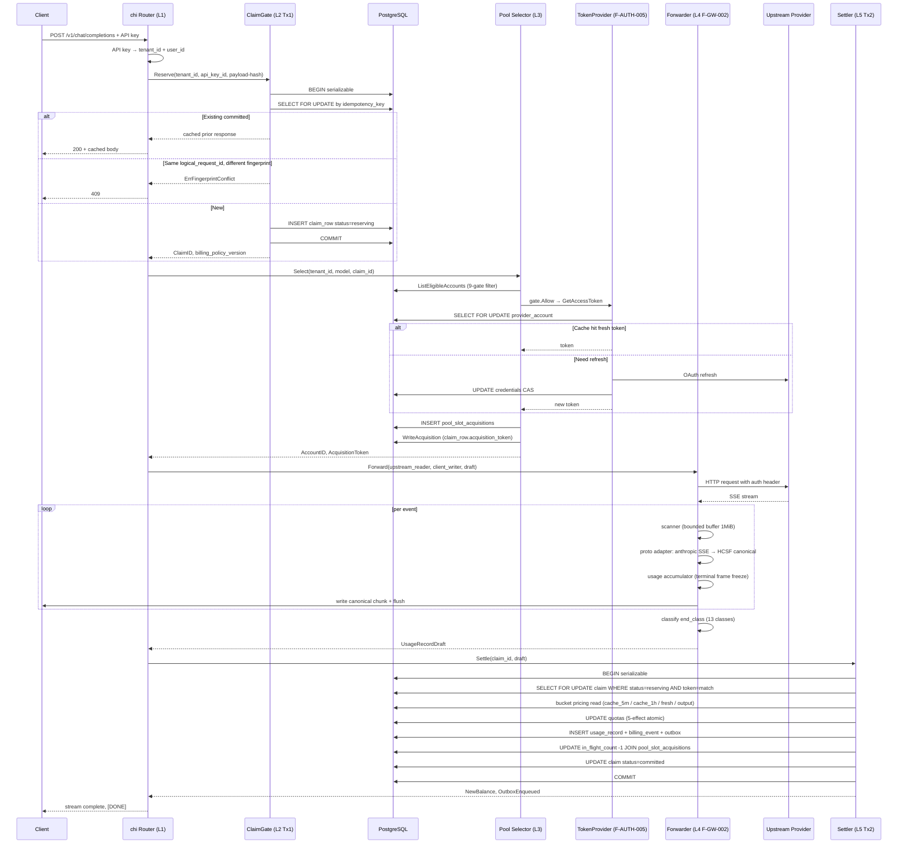

# HUAKAI 融合架构 — 项目逻辑框架

| 字段 | 值 |
| --- | --- |
| Status | v0.1 (合成自 21 份独立深度拆解材料) |
| 作者 | Claude PM-Orchestrator (Opus) |
| 日期 | 2026-04-29 |
| 输入材料 | 7 项目 × 3 视角（codex specifier R3 + codex critic + claude deep）= 21 份；7 个 inventory；7 份 Released spec；DR-001/002/006 决议；01_PROJECT_BRIEF |
| 形态 | 中文 executive 总览（Part A）+ 可视化 + 4 张表（Part B） |
| 读者 | Owner（决策入口）+ 后续 contributor（执行入口） |

---

# Part A — 一页中文 executive 总览

## 一句话产品定位

**HUAKAI 是 Sub2API 算法底座 + 多项目最佳实践融合的多租户 AI Gateway，主面向"卖 API（自部署）+ 卖 SaaS（卖给别人运营）"双业务模式（DR-002）。**

不是再造一个 sub2api / one-api。是**取 sub2api 的 layered routing + claim-gate 底座，加上 7 个参考项目里实测有效的零碎能力，做成一个能在多租户、money-grade、PostgreSQL 后端上跑得起来的产品**。

## 简化架构（5 层）

```
┌──────────────────────────────────────────────────────────┐
│  L1  HTTP entry  (chi router + auth middleware)          │
│      ↓ 解析 API Key → tenant_id + user_id                │
├──────────────────────────────────────────────────────────┤
│  L2  Tx1 ClaimGate  (F-OBS-001)                          │
│      → 计算 idempotency 9 字段 SHA-256                   │
│      → 6-row lock + insert claim row                     │
│      → 失败 = 409 / 402 / 503，从不静默丢钱              │
├──────────────────────────────────────────────────────────┤
│  L3  Pool Selector  (F-POOL-001)                         │
│      → 5 层选号: routing-config → sticky → fresh         │
│      → 9-gate 链: tenant / lifecycle / channel / model   │
│        / capability / credential* / health / group / excl│
│      → 写回 acquisition_token 到 claim row (Pattern B)   │
├──────────────────────────────────────────────────────────┤
│  L4  Auth + Proto + Forwarder (F-AUTH-005 / F-PROTO-002 │
│      / F-GW-002)                                          │
│      → 凭证刷新（OAuth + 风暴预算 + CAS）                │
│      → 协议翻译（HCSF canonical 中介）                   │
│      → SSE 流转 + 13-class end_class + drain 预算        │
├──────────────────────────────────────────────────────────┤
│  L5  Tx2 Settler  (F-OBS-001)                            │
│      → 5-effect 原子化（subscription / user / api-key    │
│        / rate-windows / provider-quota）                  │
│      → 写 usage_record + billing_event + outbox 同事务   │
│      → in_flight_count -1 (acquisition_token 校验)       │
│      → claim status: reserving → committed/aborted       │
└──────────────────────────────────────────────────────────┘
```

`*` Credential gate 是 F-POOL-001 ↔ F-AUTH-005 跨边界，已通过 AT-XFEAT-001 集成测试。

## 7 个参考项目 — 1 句定位 + 1 件吸收

| 项目 | License | 1 句定位 | HUAKAI 吸收的关键 1 件事 |
| --- | --- | --- | --- |
| **sub2api** | LGPL-3.0 | 核心算法基座（多次源核验） | 5 层 layered selection + 9-gate 链 + claim-gate Pattern B |
| **one-api** | MIT | 单租户 OSS 鼻祖；safe-anchor | **2-gate channel 自动 disable**（永久错误 + 滚动成功率，HUAKAI 默认开） |
| **portkey** | MIT | TypeScript 流式实现；多协议适配 | per-provider 流式状态机；HUAKAI 反向：bounded buffer + 13-class 终态分类 |
| **helicone** | GPL-3.0 | **README 宣称 ≠ 实际有**；只有 4 种延迟均衡 | counter-evidence：成本路由 / 规则链根本没实现，HUAKAI 自创 |
| **litellm** | MIT | 100+ provider 重路由器；4 级 retry 优先级 | **同组健康对等 0 等待 retry** + 4 级 retry hierarchy + 单部署豁免 |
| **new-api** | AGPL-3.0 | 缓存差价计费 + reasoning effort 透传 | **3-bucket 缓存定价**（5m vs 1h 1.6× 差价）+ effort 后缀语法 + 预消费/结算两段 |
| **all-api-hub** | AGPL-3.0 | 浏览器扩展凭证金库 | counter-evidence：明文存储**绝不可继承**；UX 模式（per-profile 遥测快照）可借 |
| **envoy-ai-gw** | Apache-2.0 | K8s CRD + outer/inner 双层 | 双层结构留作 SaaS Edition Phase 9+ packaging blueprint，Personal 不用 |

## 5 个最大风险（跨 21 份材料抽出，Owner 必看）

1. **HUAKAI Personal Edition 默认 auto-disable 必须开**（来源：one-api 默认两 gate 全关——HUAKAI 多租户 false-pass cost > false-disable cost，必须反过来 default-on）。修：调 schema 默认值 + spec 改 §Default Values 节。
2. **billing_policy_version 必须在 Tx1 锁定，Tx2 复用**（来源：new-api cache_ratio 全局热重载 TOCTOU）。修：claim row 已有 `billing_policy_version` 字段，settler 必须读自 claim 不读 current。
3. **Helicone 类的"宣传 ≠ 实有"风险登记进流程**（来源：truth-first 协议第一次抓到）。所有 evidence ledger 行加 "advertised vs source-confirmed" 标签；synthesis 阶段降级。
4. **all-api-hub 明文凭证模式绝不能进 HUAKAI**——服务端 KMS envelope encryption 强制（DR-006）。`provider_accounts.credentials_encrypted` bytea 列必加密层，admin export 默认排除。
5. **Pool Phase C 真 SlotManager + audit 还是 stub**（来源：codex 自审）。HUAKAI 现有代码 in-memory mock；接 PostgreSQL 后必须真用 `pool_slot_acquisitions` 表，`InsertSlotAcquisition` + `ReleaseSlotAcquisition` 配 in_flight_count CAS。

## 接下来 2-3 个工作 session 必做

按 [docs/plans/2026-04-29-integration-sprint-plan.md](plans/2026-04-29-integration-sprint-plan.md) §B-D：

- **session N+1**：把 `cmd/gateway/main.go` 接通 → POST `/v1/chat/completions` 端到端串成（带真 PostgreSQL 的 Tx1+pool+auth+forwarder+Tx2 一条线）
- **session N+2**：基于本框架补 spec deltas（见 Part B 表 C），合成成稳定 v1 specs
- **session N+3**：integration test 套件（AT-OBS-001..014 + AT-XFEAT-001 + 端到端 smoke）

---

# Part B — 可视化 + 4 张表

## 详细请求生命周期（mermaid sequence）



---

## 表 A — HUAKAI 模块 × 7 参考项目对照

| HUAKAI 模块 | sub2api | one-api | portkey | helicone | litellm | new-api | all-api-hub | envoy |
|---|---|---|---|---|---|---|---|---|
| **internal/auth/** (F-AUTH-005) | 风暴预算 + CAS 主拆 ✅ | — | — | — | — | — | — | 5min 预轮换 ✅ |
| **internal/pool/** selector (F-POOL-001) | 5 层 + 9-gate 主拆 ✅ | 重试排除 (sub-set) | — | P2C+EWMA 可借 (作为第 4 维) | 单组健康对等 0 等待 ✅ | — | — | — |
| **internal/pool/** auto-disable | — | **2-gate ✅ (改默认开)** | — | — | cooldown 5-axis 决策 ✅ | — | — | — |
| **internal/proto/** (F-PROTO-002) | adapter 主拆 ✅ | — | per-provider stream 状态机 ✅ | — | — | — | — | — |
| **internal/gateway/** forwarder (F-GW-002) | 主拆 ✅ | usage-inference fallback | bounded buffer 反例（HUAKAI 改 cap） | — | streaming usage reconciliation | 终态帧合并 cache 字段 (Claude SSE) ✅ | — | — |
| **internal/billing/** ClaimGate (F-OBS-001 Tx1) | claim-gate Pattern B 主拆 ✅ | — | — | — | — | 预消费/结算两段 ✅ | — | — |
| **internal/billing/** Settler (F-OBS-001 Tx2) | Tx2 atomic 5-effect 主拆 ✅ | — | — | — | — | **3-bucket cache 定价 ✅ + 5m/1h 1.6× 子桶 ✅** | — | — |
| **internal/rate/** (F-RATE-001) | 主拆 ✅ | — | — | GCRA per-org | — | — | — | RateLimit filter |
| **internal/obs/** | — | — | — | — | — | BillingSnapshot ExprVersion ✅ | — | — |
| **F-ROUTE-001 (cost routing, NEW)** | — | — | — | counter-evidence: **不存在 ❌** | — | — | — | — |
| **F-CONFIG-001 (rule chains, NEW)** | — | — | — | counter-evidence: **不存在 ❌** | — | — | — | CRD shape 借 (Phase 9+) |
| **F-OPS-003 admin UI** (Phase 7+) | — | — | — | — | — | — | per-profile 遥测快照 UX ✅ + custom JSON path | status conditions 借 |
| **F-DEPLOY-002** (Phase 9+ SaaS) | — | — | — | — | — | — | — | outer/inner topology + 6 CRD blueprint ✅ |

> 主拆 ✅ = sub2api 已有 source-verified 深拆，HUAKAI 7 个 Released spec 直接基于此。其余项目 ✅ = 增量贡献。`-` = 该项目未提供该模块的有效信号。`❌` = 项目宣称但源不存在（counter-evidence）。

---

## 表 B — 风险登记（21 份材料合成 17 条 HIGH/MED）

| ID | 风险 | 来源 | 关联 DR/spec | 修复 action | 优先级 |
|---|---|---|---|---|---|
| RB-1 | Personal Edition auto-disable 默认全关，false-pass 静默 | one-api 默认配置 | DR-001 + F-CH-002 | schema 改默认 + spec §Default 节 | HIGH |
| RB-2 | Pricing-version mid-flight TOCTOU race | new-api cache_ratio 热重载 | F-OBS-001 §Tx1 step 1 | claim row 锁 billing_policy_version + Tx2 复用 | HIGH |
| RB-3 | helicone-类宣传 vs 实有差距未登记 | helicone counter-evidence | clean-room CL-001 | evidence ledger 加 "advertised/source-confirmed" 标签 | HIGH |
| RB-4 | all-api-hub 明文凭证模式被误抄 | all-api-hub plaintext storage | DR-006 + F-AUTH-005 | provider_accounts.credentials_encrypted bytea + KMS envelope; 默认 export 排除 | HIGH |
| RB-5 | Pool Phase C SlotManager 仍是 in-memory mock | codex 自审 | F-POOL-001 §Phase C | 接 pool_slot_acquisitions 表 + CAS in_flight_count | HIGH |
| RB-6 | per-tenant retry budget 缺失，DOS 向量 | litellm L4 policy bypass | DR-001 + F-GW-004 | per-tenant retry-per-minute cap | HIGH |
| RB-7 | 单部署豁免按租户判定不按全局 | litellm S-5 + DR-001 | F-CH-002 | exemption check uses tenant deployment count | HIGH |
| RB-8 | Anthropic 5m vs 1h cache 子桶未拆字段 | new-api S-2 | F-OBS-001 schema | 加 cache_creation_5m_tokens + cache_creation_1h_tokens | HIGH |
| RB-9 | scanner buffer 必须 bounded（多租户 DOS） | portkey unbounded buffer | DR-001 + F-GW-002 AT-12 | ScannerBufferCap 1MiB 默认（已在 v0.1 实现） | MED-DONE |
| RB-10 | 非 Anthropic 上游错误终态无结构化帧 | portkey FM-3 | F-GW-002 13-class taxonomy | 每个 provider adapter 实现 FinalizeUpstreamStream | MED |
| RB-11 | 内存 cache 10min 滞后窗口 | one-api S-14/FM-2 | DR-006 PostgreSQL | 不引入 status filter 内存 cache；直读表 | MED-DONE |
| RB-12 | 经验式错误分类符脆弱 | one-api S-1d/e | F-AUTH-005 + F-CH-002 | 整合 typed error class + 真 provider 集成测试 | MED |
| RB-13 | 通知 best-effort 同步 + 无 dedup | one-api S-19/20 + FM-8 | F-OBS-001 audit | 通知 outbox + per (account, status_class) 60s debounce | MED |
| RB-14 | 多副本协调 (mutex 进程级 + Redis-less cooldown) | one-api S-8 + litellm FM-5 | DR-006 | leader election (PG advisory lock) for 调度探针 | MED |
| RB-15 | force-route header 未授权 | helicone S-2 | F-POOL-001 AT-016 | 加 actor authorization + audit row | MED |
| RB-16 | 8800 行 decomposition vs 真深度 | self-audit | governance | 已修：R3 truth-first; cross-validation discipline 落档 | MED-DONE |
| RB-17 | reasoning_tokens 同 output 同价 + 多租户灵活性 | new-api S-13 | F-BILL-003 | reasoning_ratio per-tenant configurable (default = completion_ratio) | LOW |

---

## 表 C — Spec / Code Delta 清单

| Delta ID | 文件 | 当前状态 | 必改成什么 | 来源风险 |
|---|---|---|---|---|
| D-1 | `docs/specs/upstream-credential-management.md` | 通用错误处理 | 加 §Per-failure-class duration（timeout 5m / OAuth 401 10m / invalid_grant permanent） | one-api S-12 + RB-12 |
| D-2 | `docs/specs/pool-routing.md` | 9-gate 描述 | 加 §Default Values 节，标注 auto-disable 默认 ON | RB-1 |
| D-3 | `docs/schema/observability-billing.sql` | `cache_creation_tokens` 单字段 | 拆 `cache_creation_5m_tokens` + `cache_creation_1h_tokens`（additive 迁移） | new-api S-2 + RB-8 |
| D-4 | `docs/schema/observability-billing.sql` | `billing_policy_version` 已有 | 文档化 "Tx1 锁定 Tx2 复用" invariant | RB-2 |
| D-5 | `docs/schema/upstream-credential-management.sql` | `credentials` text/jsonb | 改 `credentials_encrypted` bytea + envelope encryption header | RB-4 |
| D-6 | `backend/internal/pool/slot.go` | `nilSlotManager` 占位 | 实现 `pgSlotManager` 用 pool_slot_acquisitions 表 + CAS in_flight_count | RB-5 |
| D-7 | `backend/internal/pool/auth_credential_gate.go` | 已存在但仅查 token | 加分类 + temp_unsched_until 检查 | RB-12 + 已有 AT-XFEAT-001 |
| D-8 | `backend/internal/billing/claim_gate.go` (重写) | 之前有 quarantined slice5 broken | 按 plan §B.4 全新实现 + 9-字段 hash + Tx1 + 6-row lock | 集成 sprint plan |
| D-9 | `backend/internal/billing/settler.go` (重写) | quarantined | 按 plan §B.5 全新实现 + 5-effect + Tx2 atomic + bucket math | 集成 sprint plan |
| D-10 | `backend/internal/gateway/forwarder.go` | 13-class end_class + bounded buffer ✅ | 加 per-tenant retry budget enforcement (Phase 4.5) | RB-6 |
| D-11 | `backend/cmd/gateway/main.go` | 17 个 stub 返 501 | 接 pgxpool + DI 5 个 internal package + 1 个真 chi handler | 集成 sprint plan §C |
| D-12 | `docs/specs/observability-billing.md` | claim-gate Pattern B | 文档化 "billing_policy_version pin" invariant | RB-2 |
| D-13 | (新文件) `docs/specs/admin-export.md` | 不存在 | 写明 export 默认排除 credentials；passphrase 加密 | RB-4 |
| D-14 | `docs/07_REFERENCE_EVIDENCE_LEDGER.md` | 现有 E-* 行 | 每行加 "advertised / source-confirmed" 标签 | RB-3 |
| D-15 | (新文件) `docs/specs/notification-policy.md` | 不存在 | 通知 outbox + 60s debounce 规则 | RB-13 |

---

## 表 D — Open Questions（合成阶段未解决，等 Owner 决策）

| Q-ID | 问题 | 关联 | 决策影响 |
|---|---|---|---|
| Q-1 | F-ROUTE-001 (cost-aware routing) 是否进 v1.0 范围？helicone 反向证明该功能 OSS 项目都没真做过 | RB-3 + 表 A 该列空 | v1.0 是否含成本路由 ↔ Personal Edition 商业化定位 |
| Q-2 | F-CONFIG-001 (custom rule chains) 是否进 v1.0？同样无上游 blueprint | 同上 | 同上 |
| Q-3 | SaaS Edition K8s packaging 何时开始？envoy 双层是 Phase 9+ 蓝图 | RB-10 + envoy ALL | 影响 v1.0 后规划 |
| Q-4 | Personal Edition 是否引入 webhook 通知（替代纯邮件）？ | one-api S-19 + RB-13 | 操作员体验决策 |
| Q-5 | reasoning-effort 通过模型名后缀 vs body 字段，HUAKAI 选哪个语法权威？ | new-api S-8 + RB-17 | API contract 稳定性 |
| Q-6 | 缓存信号沉默 provider（如 Gemini）是否需要补差异化处理？ | new-api S-7 + RB-8 | 边缘 provider 接入策略 |
| Q-7 | 引用项目持续追踪节奏：每周？每月？发版触发？ | DR-024 reference-tracking-policy | 维护成本 vs 漂移风险 |
| Q-8 | helicone 的 P2C+EWMA 延迟均衡策略，是否值得作为 F-POOL-001 第 4 维加入？ | helicone S-4 + RB-7 | F-POOL-001 spec v1.1 增量 |

---

## 附：21 份输入材料目录

```
docs/decompositions/
├─ sub2api/                          (R1 已存在，未重做)
│  ├─ auth-token-source-verified.md
│  ├─ layered-account-selection.md
│  ├─ observability-source-verified.md
│  ├─ protocol-translation-source-verified.md
│  └─ rate-limiting-source-verified.md
│
├─ one-api/
│  ├─ channel-auto-disable-source-verified.md     (Codex R3, 376 行)
│  ├─ channel-auto-disable-claude-deep.md         (Claude R3, 245 行)
│  └─ quota-billing-source-verified.md            (R1 已存在)
│
├─ portkey/
│  ├─ streaming-handler-source-verified.md        (Codex R3)
│  ├─ streaming-handler-claude-deep.md            (Claude R3)
│  └─ protocol-translation-source-verified.md     (R1 已存在)
│
├─ helicone/
│  ├─ cost-aware-routing-source-verified.md       (Codex R3)
│  ├─ cost-aware-routing-claude-deep.md           (Claude R3 — 含 truth-first counter-evidence)
│  └─ observability-source-verified.md            (R1)
│
├─ litellm/
│  ├─ cooldown-retry-hierarchy-source-verified.md (Codex R3)
│  ├─ cooldown-retry-hierarchy-claude-deep.md     (Claude R3)
│  └─ pool-fallback-source-verified.md            (R1)
│
├─ new-api/
│  ├─ cache-billing-reasoning-source-verified.md  (Codex R3)
│  └─ cache-billing-reasoning-claude-deep.md      (Claude R3)
│
├─ all-api-hub/
│  ├─ credential-vault-comparison-source-verified.md  (Codex R3)
│  └─ credential-vault-comparison-claude-deep.md      (Claude R3 — 含 plaintext counter-evidence)
│
├─ envoy-ai-gateway/
│  ├─ topology-crd-source-verified.md             (Codex R3)
│  └─ topology-crd-claude-deep.md                 (Claude R3)
│
├─ _superseded-round1/  (R1 浅版 quarantined)
└─ _superseded-round2/  (R2 浅版 quarantined)

.omc/artifacts/decomp-critic/  (Codex critic 7 份, ~12-13 KB each)
├─ C1-oneapi-channel-auto-disable.md
├─ C2-portkey-streaming-handler.md
├─ C3-helicone-cost-routing.md
├─ C4-litellm-cooldown-retry.md
├─ C5-newapi-cache-reasoning.md
├─ C6-aah-credential-vault.md
└─ C7-envoy-topology.md
```

总输入：~100K+ 字源核验材料 + 7 个 inventory + 7 个 Released spec + DR + brief。

---

## 附：交付状态

- [x] 21 份独立深度拆解（codex specifier R3 + codex critic + claude deep）
- [x] truth-first 协议落档（AGENTS.md + CLAUDE.md）
- [x] plan-before-execute 协议落档
- [x] 本文件（融合架构总论）
- [ ] 7 份 per-feature synthesis（暂缓——需要时分别合成）
- [ ] Sprint plan §B 集成（PostgreSQL + Tx1/Tx2 真实现 + main.go 接通）
- [ ] Spec deltas D-1..D-15 落档到对应 spec 文件
- [ ] v1.0 release gate decision

下次 session 入口：从表 C 选 ≤3 个 D-id 作为单 session 目标，按 plan-before-execute 写 plan，然后执行。
