# HUAKAI 项目与架构白皮书

> 文档状态：待 Owner 审核的唯一项目总纲候选
> 事实基线：`origin/main@71abcf8ed7557575eedae8595d4727cd07117be5`
> 核实日期：2026-07-23
> 语言：中文；代码标识符、协议名和环境变量保留英文
> 当前权威性：本分支唯一总纲候选；Owner 批准 PR 并合入主线后成为项目级唯一总纲

## 0. 这份白皮书解决什么问题

HUAKAI 已经是一个大型后端项目。当前主线包含：

| 资产 | 主线实数 | 统计口径 |
| --- | ---: | --- |
| Go 包 | 339 | `backend` 模块内 `go list ./...` |
| Go 生产文件 | 1344 | `backend/**/*.go`，排除 `_test.go` |
| 第一方 Rust 工作区源码 | 61 | 排除 `tests/` 与 `target/`；其中 9 个 Sidecar 文件进入生产镜像，其余不进入当前镜像 |
| PostgreSQL 迁移文件 | 426 | `backend/sql/migrations/*.sql` |
| SQL 查询源 | 55 | 非迁移 SQL，作为 sqlc 或运行查询合同 |
| PostgreSQL 业务表 | 149 | 从当前迁移最终态解析 |
| 工程工具与部署资产 | 61 | 源码责任索引纳入的 Docker、Compose、CI、Hook、Python、Shell 与独立 Go 工具 |

过去的问题不是“完全没有文档”，而是项目级 Brief、架构说明、阶段计划、功能树、
审计报告和大量临时计划同时存在。它们的更新时间、事实来源和状态口径不一致，导致：

1. 新参与者无法快速判断哪一份才是当前真相。
2. 已经落地的能力仍被旧文档写成“缺失”，或只有代码骨架却被写成“完成”。
3. 修复一个点时容易漏掉同链路的身份、路由、凭据、资金、日志和恢复。
4. 多个开发会话可能重复造功能，合并时覆盖或丢失另一条链上的能力。
5. 文件越来越多，却没人能回答每个包、每个生产文件为什么存在。

本白皮书收口五类真相：

- **产品真相**：HUAKAI 服务谁，解决什么问题，明确不做什么。
- **架构真相**：请求、控制、资金、运维、恢复和部署怎样联动。
- **源码真相**：每个功能域、包和生产文件的责任、目的及验证入口。
- **状态真相**：已决策、已实现、已接线、已测试、活体验证、可上线不能混写。
- **工程真相**：需求、缺陷、变更、测试、PR 和发布如何形成闭环。

### 0.1 事实优先级

本项目永远以主线真码为主，白皮书不是代码的上级。发生冲突时按以下顺序定性：

1. **生产代码与真实接线**：路由是否挂载、依赖是否注入、运行路径是否实际调用。
2. **数据库 schema 与部署配置**：迁移、约束、容器、启动顺序和环境合同。
3. **判别式测试与运行证据**：测试是否会因旧缺陷复现而转红，真实环境是否跑通。
4. **本白皮书**：把前三类事实组织成可导航、可审计的项目地图。
5. **历史计划、审计和研究**：只能作为线索，不能覆盖当前真码。

若主线代码变化而白皮书没有同步，必须把白皮书标记为陈旧并修正；不得为了维护文档表面一致
而隐瞒代码现状。反过来，发现代码偏离已确认的产品合同，也不能把“代码现在如此”自动当成
正确设计，必须记录差异并通过 PR 修复或由 Owner 重新决策。

### 0.2 白皮书与操作记录边界

本白皮书记录长期稳定的项目真相，不承担开发流水账职责。

| 内容 | 归属 | 是否进入白皮书 |
| --- | --- | --- |
| 产品定位、三身份、能力边界、总体架构、技术栈 | 白皮书 | 是 |
| 功能域、生产链路、数据合同、运维恢复和发布标准 | 白皮书 | 是 |
| 核心算法、状态机、事务、幂等、失败分支和影响分析 | 工程设计手册 | 只保留架构级摘要与链接 |
| 第一方生产代码的职责导航与影响半径 | 源码责任索引（由白皮书功能编号约束） | 只保留方法与链接 |
| 某次缺陷的现象、复现、根因和关闭条件 | GitHub Issue | 否 |
| 某次修改的文件、提交、测试结果和审查结论 | PR、commit、CI | 否 |
| 某次发布的版本、迁移、部署与回滚结果 | Release 与发布记录 | 否 |
| 当前工作进度、临时待办和会话记忆 | 当前执行计划 | 否，完成后删除 |
| 测试文件、第三方依赖和生成代码逐文件目录 | 自动校验或构建系统 | 否 |

白皮书可以定义“变更必须留下哪些证据”，但不复制每次变更的证据正文。需要追查历史时，
通过功能编号、Issue、PR、commit 和 Release 反查，避免稳定架构文档被时间线淹没。

## 1. 产品定义

### 1.1 一句话定义

HUAKAI 是一个面向部署者、下级租户和最终用户的多租户 AI API 中转与账号运营平台。
它把官方 API Key、订阅账号、OAuth/Session 账号和可选代理统一接入账号池，对外提供
OpenAI、Anthropic、Gemini 等兼容入口，并在每次调用中完成身份识别、模型解析、池组
路由、账号选择、协议转换、出站、用量核算、余额与配额处理、日志、健康反馈和失败恢复。

### 1.2 产品目标

1. **对用户稳定**：一个 HUAKAI Key 可以按授权调用一个或多个模型，不需要理解上游账号细节。
2. **对租户隔离**：租户只能看到和操作自己的用户、Key、额度、账号和池组授权。
3. **对部署者好运维**：账号、模型、池、凭据、代理、健康、配额、资金、日志和恢复有统一入口。
4. **对故障可恢复**：失败能够分类、重试、换号、换池、换模型、补账或进入人工恢复队列。
5. **对账可证明**：调用使用了什么模型、池、账号、上游和费用口径，应留下可查询证据。
6. **对扩展有边界**：新厂商、新协议和新能力通过明确 adapter、registry、router 和 transport 接口接入，
   不在热路径继续堆一套平行实现。

### 1.3 当前不应误报的事项

- 当前仓库没有可信前端源码，生产镜像按 API-only 构建。现存前端设计和旧页面不能作为产品完成证据。
- 项目尚未上线，代码存在不等于经过真实账号和生产拓扑验证。
- `/v1/realtime` 当前为明确的未实现入口，不能宣称已支持实时协议。
- Cursor、Copilot、Windsurf 按 Owner 决策封存到主链可上线之后，不进入当前上线闭环。
- 参考项目只提供行为证据，不能成为 HUAKAI 代码、目录、注释或 schema 的来源。

### 1.4 利益相关者

| 相关者 | 关心的结果 |
| --- | --- |
| 部署者 | 系统可部署、可观察、可恢复，账号和资金事实准确，高风险能力可控 |
| 下级租户管理员 | 本租户独立经营，用户、Key、余额、账号和日志不被其他租户读取或修改 |
| 最终用户 | Key 稳定、模型可见性真实、调用与扣费可解释、问题能够申诉和追踪 |
| 开发与审查人员 | 模块边界明确、变更影响可判断、已有能力不会因合并或重复实现丢失 |
| 运维人员 | 告警可行动、手册与当前部署一致、备份可恢复、故障有自动和人工出口 |
| 安全与合规人员 | 凭据不泄漏、权限最小化、依赖可追溯、外部行为证据符合 clean-room |

### 1.5 最高优先级质量目标

质量目标按优先级约束所有功能，不允许为了“先跑起来”静默牺牲：

1. **租户与权限正确**：任何配置故障、缓存故障或兼容回退都不能造成跨租户或越级使用池组。
2. **资金和配额正确**：预扣、结算、退款、补账和余额转移必须幂等、可追溯、可恢复。
3. **协议和上游行为正确**：客户端看见的响应、错误、流式终止和用量必须与目标协议一致。
4. **故障可恢复**：上游、数据库、Redis、Sidecar、worker 或结算失败时有明确拒绝、重试、
   回退、DLQ 或人工恢复语义。
5. **好运维**：部署者能看见真实状态、影响范围、错误分类和恢复结果，不依赖读数据库猜测。
6. **安全和秘密保护**：凭据加密、日志脱敏、SSRF 防护、最小权限和第三方隔离必须默认生效。
7. **可维护**：一个能力只有一个生产实现，包和文件按职责组织，文档与主线同步。

### 1.6 架构硬约束

- PostgreSQL 是业务事实、账本、配置和恢复事实的权威存储；Redis 只保存可丢弃的短期共享状态。
- Go Gateway 承载当前数据面、控制面和运维面；Rust Sidecar 承担明确需要指纹的推理出站，
  当前也被 CRS 外部安全源传输复用，并进入 Gateway 启动与就绪依赖。
- 官方 API Key 不能误入仿真出口；需要仿真的账号也不能静默回退标准 TLS。
- Gateway 不自行竞争执行生产迁移；生产 Compose 由一次性 `migrate` 服务先完成迁移。
- 当前部署是 API-only；前端重构前，旧页面和按钮不构成能力证据。
- 三身份及其余额、用户和能力授权边界是全局合同，业务模块不得私自定义第四类角色。
- 普通日志按 30 天清理；永久账本和资金幂等事实不受日志清理影响。
- 外部项目只提供行为合同，HUAKAI 保持 MIT clean-room 独立实现。

## 2. 三身份业务模型

HUAKAI 只有三类业务身份。技术上可以有多种凭据形态，但不能因此增加第四种业务角色。
本节先定义 Owner 已确认的产品合同；“源码边界证据”随后如实区分已经落实和仍未统一的入口，
不能把目标合同冒充为全局已实现。

### 2.1 部署者

部署者是系统所有者，对应平台级管理能力。代码中的主要身份是
`platform_admin`，可以来自 `admin_tokens` 或平台管理员会话。

部署者负责：

- 系统级配置、部署、备份、日志、告警和运行状态。
- 上游厂商、账号、凭据、代理、模型目录、池组和路由策略。
- 平台自有租户中的用户和 Key。
- 向下级租户钱包增加或减少余额。
- 授予或收回下级租户的高风险能力，例如高级账号接入和 Hermes 运维助手。

部署者不得：

- 直接读写下级租户的最终用户资料。
- 越级给下级租户的最终用户增减余额。
- 使用全局权限替下级租户执行日常用户管理。

### 2.2 下级租户

下级租户是租用部署者系统部分能力的独立经营主体。代码中的主要管理身份是
`tenant_operator`，必须绑定唯一 `ScopeTenantID`。

下级租户负责：

- 管理本租户的最终用户。
- 签发、吊销和查看本租户用户的 HUAKAI Key。
- 在本租户钱包范围内给用户分发或回收余额。
- 操作部署者分配给本租户的账号、模型和池组能力。
- 在部署者授权后使用高级账号导入、Hermes 等高风险能力。

下级租户不得：

- 读取或操作其他租户的用户、Key、余额、账号、池组和日志。
- 签发平台级管理凭据。
- 修改系统全局配置。

### 2.3 最终用户

最终用户隶属于一个租户。平台自有用户和下级租户创建的客户在业务角色上都属于最终用户，
差别只在 `tenant_id`。

最终用户负责：

- 注册、登录、维护自己的会话和安全凭据。
- 创建和管理自己被允许创建的 HUAKAI Key。
- 使用 Key 调用模型。
- 查看自己的用量、费用、配额、回执、争议和通知。

最终用户不得进入管理员路由，也不得直接操作上游账号、凭据、池组和 Hermes。

### 2.4 三身份关系图

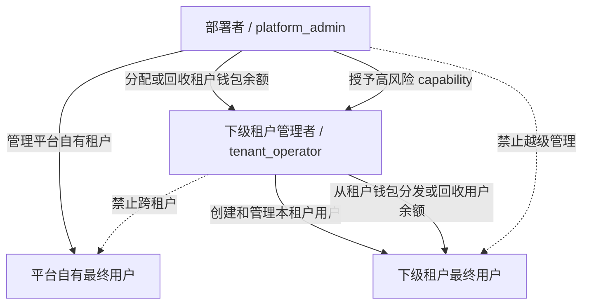

源码边界证据：

- `backend/internal/admin/admin.go:47` 定义平台管理员和租户管理员两类管理角色。
- `backend/internal/admin/operator_auth.go:140` 限定租户管理员只能操作自身 scope。
- `backend/internal/adminuserhttp/tenant_scope.go:15` 限定部署者只能管理平台自有租户用户。
- `backend/internal/balanceledger/service.go:375` 区分平台到租户钱包、平台自有用户和租户到用户三类余额动作。
- `backend/internal/tenantcapability/store.go:61` 对缺失授权默认拒绝。
- 当前边界尚未全局统一：`backend/internal/adminhttp/api_keys_handler.go` 仍允许平台管理员指定任意
  `tenant_id` 管理用户 Key，`backend/internal/controlhttp/dispute_handler.go` 也保留平台管理员跨租户
  处理争议的路径。它们与上述 Owner 合同存在差距，必须在独立鉴权变更中收口；本白皮书不把它们
  误报为已经完成。

## 3. 系统总体架构

### 3.1 系统上下文图

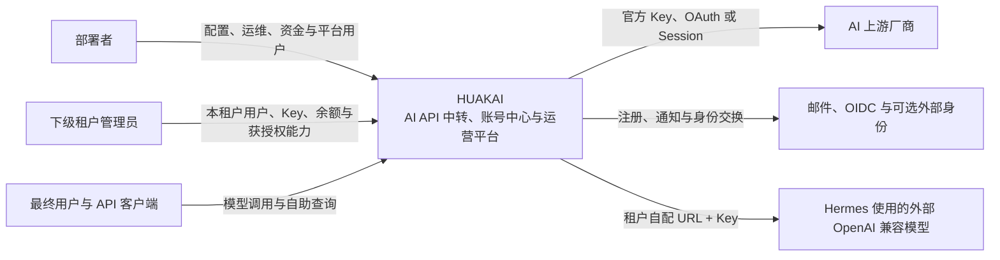

HUAKAI 是系统边界。数据库、Redis、Sidecar 和 Hermes Runner 是边界内的部署构件；
AI 厂商、邮件/OIDC 和租户选择的外部模型是边界外依赖。

### 3.2 容器图

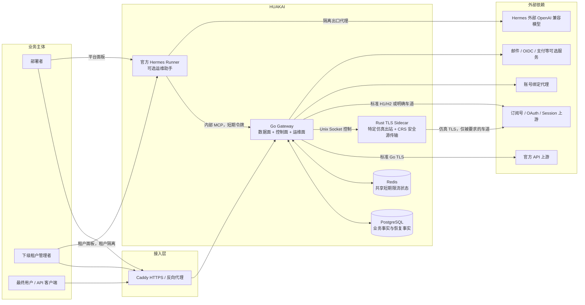

### 3.3 四个逻辑平面

| 平面 | 责任 | 主要入口 | 关键代码域 |
| --- | --- | --- | --- |
| 数据面 | 接收模型调用、选路、出站、返回、计费 | `/v1/*`、`/v1beta/*` | `gatewayhttp`、各协议 `*http`、`registry`、`router`、`pool`、`gateway`、`provider`、`transport` |
| 控制面 | 配置用户、Key、账号、模型、池、价格、配额和能力授权 | `/admin/v1/*`、用户自助入口 | `admin*`、`accountintake`、`credential*`、`model*`、`pool*`、`quota*`、`subscription*` |
| 运维面 | 日志、健康、告警、服务器监测、巡检、Hermes 和人工恢复 | 管理 API、`/v1/hermes/*` | `channelhealth`、`alerting`、`servermonitor`、`opsinspection`、`hermes*`、`dlq*` |
| 持久与恢复面 | 保存业务事实、幂等、账本、审计证据、outbox、DLQ、租约和重放 | PostgreSQL + worker | `db/*`、`billing`、`auditledger`、`eventbus`、`settlementrecovery`、`obs/dlq` |

平面是逻辑边界，不是四个独立服务。当前生产入口主要由一个 Go Gateway 进程承载。
同镜像中的 Rust Sidecar 提供特定 TLS 仿真能力，CRS 安全源传输也通过它出站；当前组合根
还把 Sidecar 进程纳入全局启动和 readiness，因此即使某次推理不走仿真，部署仍需要它健康。

### 3.4 重要构件视图

只展开影响产品行为、跨模块、资金、权限、外部协议或恢复的构件。普通工具类和简单文件不在
白皮书逐个展开。

| 构件 | 主要生产位置 | 责任 | 主要输入与输出 | 修改爆炸半径 |
| --- | --- | --- | --- | --- |
| 生产组合根 | `backend/cmd/gateway` | 加载配置、注入依赖、挂路由、启动 worker、readiness 与 drain | 环境、数据库、Redis、Sidecar → HTTP 服务和后台任务 | 全部端点、启动、部署、多副本 |
| 身份与租户 | `internal/auth`、`tenancy`、`userauth`、`admin*` | 用户和管理身份、租户 scope、会话、Key、能力授权 | 请求凭据 → 已验证三身份上下文 | 越权、跨租户、所有控制面与数据面 |
| 账号接入 | `internal/gatewayhttp/accountintake`、`credentialacq`、`accountbundle` | 导入来源识别、身份消歧、计划确认、创建/更新账号 | Cookie/OAuth/文件/CRS/迁移包 → 账号和凭据 | 凭据、账号重复、租户权限、订阅和配额 |
| 凭据与账号事实 | `credentialstore`、`credentialworker`、`subscriptionprofile`、`accountquota` | 加密、版本、刷新、订阅标签、配额窗口 | 账号身份和上游响应 → 可调度凭据与运营投影 | 全部账号转 API 车道 |
| 模型目录 | `registry`、`modelsync`、`model*http` | canonical model、alias、能力、可见性、模型发现 | 租户和公开模型名 → 规范模型与 binding | 所有协议、池组、价格和前端模型视图 |
| 池组与路由 | `router`、`pool`、`bindingfallback`、`modelfallback` | 池绑定、attempt 计划、账号选号、并发槽位、回退 | 身份、模型、请求能力、健康和配额 → 账号尝试 | 越级用池、稳定性、成本、账号封禁风险 |
| 协议与厂商 | `gatewayhttp`、各 `*http`、`proto`、`provider` | 入口合同、canonical/HCSF、厂商适配和错误语义 | 客户协议 ↔ HUAKAI 规范 ↔ 上游协议 | 兼容、工具、流式、多模态、用量 |
| 出站 | `transport`、Rust `tls-sidecar` | 标准 TLS、特定仿真、账号代理、超时与取消 | adapter 请求和账号网络合同 → 上游连接 | 所有上游可用性、IP 和 TLS 身份 |
| 资金与配额 | `billing`、`balanceledger`、`quota*`、`budget*`、`pricing*` | 定价、预扣、结算、退款、钱包和限制 | 身份、模型、预测/真实用量 → 账本和余额 | 资金损失、重复扣费、误拒绝或透支 |
| 日志与恢复 | `log*`、`audit*`、`dlq*`、`eventbus`、`settlementrecovery` | 分类日志、签名证据、outbox、DLQ、重放和人工恢复 | 全链事件 → 可查询证据与恢复任务 | 可追责性、资金恢复、隐私和存储 |
| 健康与运维 | `channelhealth`、`observability`、`alerting`、`servermonitor`、`opsinspection` | 信号聚合、状态机、探测、告警、节点监测和巡检 | 请求/worker 信号 → 选号 gate 和运维视图 | 调度、故障隔离、告警噪音和恢复 |
| Hermes | `hermes*`、`deploy/hermes-runner` | 官方 Runner 接入、租户工具、确认、隔离出口和恢复 | 管理身份、外部模型 URL/Key → 受控查询或操作 | 高权限运维、租户隔离、SSRF 和资源占用 |

## 4. 一次模型调用的完整链路

### 4.1 主链路图

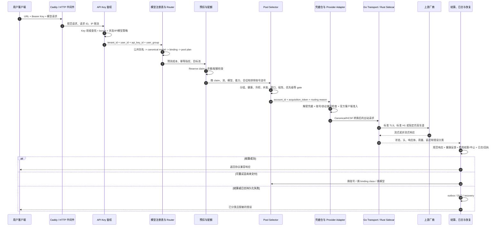

### 4.2 链路分解

#### 第 1 段：边缘接入

- Caddy 终结公网 TLS，Gateway 只在 Compose 内网暴露 `8080`。
- 中间件负责请求 ID、来源 IP、基础限流、panic 恢复、日志和通用安全头。
- `healthz` 仅证明进程存活，`readyz` 还要反映依赖和 drain 状态。

#### 第 2 段：Key 与业务身份

- 客户 Key 使用 `hk_live_` 或 `hk_test_` 命名空间，明文不入库。
- 解析器先按 16 字符前缀最多取 5 个候选，再做 bcrypt 验证。
- Key、用户和租户都必须处于 active。
- IP 黑名单优先于白名单；模型 allowlist 在解析请求模型后执行。
- 成功身份包含 `TenantID`、`UserID`、`APIKeyID` 和 `UserGroup`，后续各层不能重新猜身份。

#### 第 3 段：模型解析

- 客户请求的公开模型名先规范化，再在租户目录中解析。
- 租户可以有私有 alias；只有明确开启继承时才回落到全局目录。
- 解析结果包含 canonical model、上游 model、协议族、能力、上下文窗口和候选 binding。
- Registry 使用只读 `REPEATABLE READ` 快照，避免一次解析读到互相不一致的目录版本。

#### 第 4 段：路由计划

- Router 根据模型 binding、池组、协议族和入口给出的约束生成有序 attempt 计划。
- chat 的 stream、vision、tool、JSON 和 audio-input 特性在模型/协议层校验，不再被映射成账号级
  `capability_flags`；否则空标记账号会被误判为无容量，并产生跨模型能力误授权。
- 图片、embeddings、rerank、视频等确属账号资格的能力，仍由各自入口显式加入账号级选号门。
- Key 可以被服务端限制到单一池组；不匹配时对外表现为模型不可用，不能绕过。
- binding 可以定义优先级、同优先级权重、上游模型覆盖、RPM/TPM、并发上限和 fallback class。

#### 第 5 段：预扣、幂等与配额

- 在接触上游前预测成本并建立 billing claim。
- 同一逻辑请求 ID 配不同载荷返回幂等冲突，不能重复扣费。
- 余额不足直接拒绝。
- 幂等命中优先从持久重放记录返回原响应，不依赖易淘汰的 L2 缓存。
- 配额明确拒绝时会中止 claim；当前 chat 主链在配额基础设施异常时记录告警后放行，
  这是必须在发布门中单独审查的现状，不能隐藏成“全部 fail-closed”。

#### 第 6 段：池组与账号选择

池组不是简单随机列表。一次选择会综合：

- 租户、用户组、模型、协议族和 endpoint family。
- 账号是否属于目标池及是否允许调度。
- 账号健康、限流冷却、配额窗口、上下文窗口和会话并发。
- binding 的 RPM、TPM 和最大并发。
- sticky/session affinity、优先级和加权策略。
- 同一请求已经失败的账号排除。
- acquire token 和数据库 slot，防止多个副本同时超卖同一账号容量。

分组路由配置读取失败时必须 fail-closed，不能让普通组临时进入本租户更高等级的池。

#### 第 7 段：凭据与账号能力

- 选中账号后，Credential Vault 按 `tenant_id + account_id` 解析和解密凭据。
- 凭据类型、账号类型、平台和协议族必须兼容。
- OAuth/Session 账号可触发去重后的热路径刷新，但刷新不允许形成风暴。
- 上游个人身份、订阅、额度窗口、代理和 TLS 档案属于账号事实，不能散落到请求 body 临时猜测。

#### 第 8 段：协议和出站

- 客户协议先转成 HUAKAI 的 canonical/HCSF 表示，再由 Provider Adapter 生成上游请求。
- 协议转换发生能力损失时记录 `protocol_loss`，供计费和日志解释。
- 官方 API Key 默认走标准 Go `net/http` 出口。
- 需要特定 TLS 客户端形态的订阅号车道走 Rust/BoringSSL Sidecar，Sidecar 缺失时 fail-closed，
  不能静默降级成另一张 TLS“脸”。
- CRS 外部安全源拉取当前也复用 Sidecar；这是控制面传输，不等于所有官方 Key 推理都走仿真。
- Antigravity 推理当前走标准 TLS + HTTP/1.1，控制面路径允许标准协商。
- 账号绑定代理由唯一代理解析点显式应用；环境变量里的全局 `HTTP_PROXY` 不能截胡账号 IP 隔离。

#### 第 9 段：响应、重试和回退

- 未向客户端交付字节前，分类为可重试的失败可以换号。
- 身份失败有独立的有限子预算，不能无限刷新或轮询。
- 普通 binding class 耗尽后，可以按证据进入配置好的目标 class。
- 账号池仍无容量时，外层可以按模型 fallback 规则换模型。
- 一旦流式响应已开始交付，就不能再换账号或换模型拼接另一条响应。

#### 第 10 段：结算、日志和恢复

- 非流式响应先形成 canonical 用量和审计账本证据，再计算实际费用并结算。
- 失败路径必须中止预扣；不能留下永久占用余额的悬挂 claim。
- 结算事件必须带审计账本 ID/签名或 DLQ 引用，缺失时拒绝 money path。
- 直接结算失败可进入 settlement recovery；异步事件失败进入 outbox/DLQ。
- 账号健康接收成功、401、429、5xx、超时和协议错误信号，反哺后续选号。
- 日志按 operation、financial、security、error、access、recovery 分类；普通日志保留 30 天。

### 4.3 协议入口与主链复用

`backend/cmd/gateway/routes.go` 将同步协议注入同一组身份、Registry、Router、ClaimGate、
QuotaReserver、Selector、CredentialVault、Dispatcher、Settler、健康反馈和恢复依赖。
这说明它们已经接入统一框架，但不等于所有真实厂商和模型都已活体验证。

| 入口 | 路由、账号与凭据 | 计费与配额 | 健康与恢复 | 当前源码状态 |
| --- | --- | --- | --- | --- |
| Chat、Responses、Messages | 复用 Chat 主链 | 统一预扣和结算 | retry、fallback、结算意图、DLQ | 已接线 |
| Legacy Completions | 独立 handler，复用同组依赖 | 统一预扣和结算 | retry、部分流交付、DLQ | 已接线 |
| Embeddings、Gemini Embed | 统一 Registry/Router/Selector | 统一预扣和结算 | retry、fallback、DLQ | 已接线 |
| Rerank | 统一 Registry/Router/Selector | 统一预扣和结算 | retry、fallback、DLQ | 已接线 |
| Images 生成、编辑、变体 | 统一账号链，端点有独立 body 限制 | 图片价格与统一结算 | 外部副作用保护、取消、DLQ | 已接线 |
| Audio 语音、转写、翻译 | 统一账号链 | 音频价格与统一结算 | retry、fallback、DLQ | 已接线 |
| Gemini generate/stream | 转换后复用 Chat 主链 | 统一预扣和结算 | 同 Chat | 已接线 |
| Grok/Gemini Video | 持久媒体任务和账号绑定 | 异步 claim 与终态结算 | 租约、孤儿记录、对账和追扣 | 已接线 |
| Count Tokens | 读取模型和账号能力 | 不扣费 | 重试和槽位释放 | 辅助链 |
| 旧 `/v1/media-tasks` 等旧媒体链 | 独立任务选择 | 独立 claim/hold | 有任务租约，未统一健康反馈 | 待收口旧链 |
| `/v1/realtime` | 无 | 无 | 无 | 固定返回 501 |

### 4.4 异步视频与媒体任务链

视频不能按普通同步 HTTP 响应处理。当前主线为 Grok/Gemini 视频建立持久任务链：

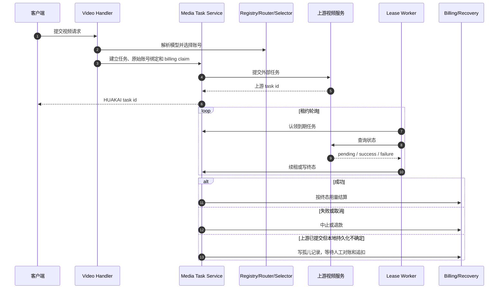

任务必须保存原始账号、池、协议、模型、租户和请求身份。worker 多副本依靠数据库租约，
不能重复轮询或重复结算；提交后的不确定状态不能假装失败退款，必须进入孤儿恢复。

## 5. 控制面架构

### 5.1 控制面不是旁路

控制面写入的账号、模型、池、binding、凭据、价格和能力授权，必须成为数据面下一次请求
真实读取的事实。只有表、类型或 CRUD，没有被热路径消费的能力属于空心能力。

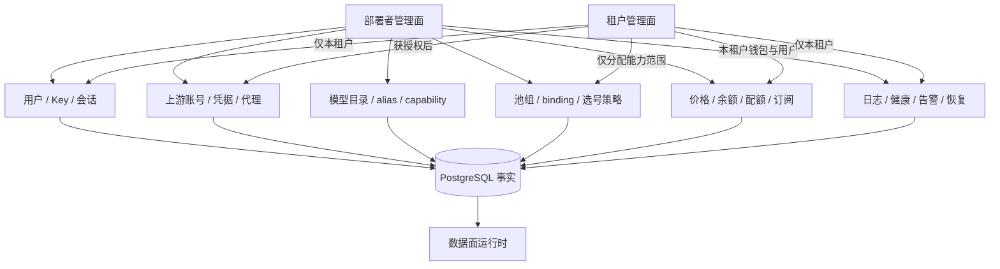

### 5.2 账号接入主链

账号接入的目标不是“保存一段 token”，而是形成一个可路由、可刷新、可观察、可恢复的账号：

```text
输入来源
  -> 识别厂商、模式和导入格式
  -> 获取或交换凭据
  -> 解析稳定上游身份
  -> 同租户消歧
  -> 创建或更新 provider_account
  -> 加密保存 credential
  -> 识别订阅套餐、到期、额度窗口和可用模型
  -> 绑定代理与 TLS 档案
  -> 加入池组并设置调度状态
  -> 写日志和导入结果
  -> 后台刷新、健康采集、模型同步
  -> 数据面实际选号和出站
```

同一稳定上游身份出现多条候选时必须明确冲突并要求人工消歧，不能“随便更新第一条”。

当前主线已经挂载以下正式接入入口；“存在入口”只证明已接线，不等于所有厂商都已活体验证：

| 接入方式 | 现行行为 | 生产证据 |
| --- | --- | --- |
| 通用 JSON、CSV、CLI 文本 | 先生成计划和摘要，再凭 `plan_hash`、确认项执行；逐项返回创建、更新、跳过、冲突或失败 | `accountintakehttp.Mount`、`accountintake.Service.Execute` |
| Codex 批量 | 解析多份凭据材料，复用统一计划、消歧、事务和结果合同 | `/account-imports/codex/*` |
| Codex Agent Identity | 导入后建立 Agent 所需任务材料，再进入统一账号与凭据事务 | `/account-imports/codex-agent/*` |
| Claude Setup Token | 独立正式入口，不要求先手工创建空账号 | `/account-imports/claude-setup-token/*` |
| Claude Cookie | Cookie 只用于换取凭据；原始 Cookie 不落普通日志，成功后仍走统一账号落库 | `/account-imports/claude-cookie/*` |
| OAuth | 支持 start、callback、poll、plan、execute；临时 flow 与操作者、租户绑定并防重放 | `/account-imports/oauth/*` |
| CRS | 先拉取和预检，再逐项执行，不能把远端结果直接无条件写库 | `/account-imports/crs/*` |
| 账号迁移包 | 加密导入导出、计划确认、逐账号事务和部分成功结果 | `/account-bundles/*` |

部署者的账号接入作用域固定为平台工作租户，不能替下级租户操作。租户管理员只有得到
`advanced_account_intake` 授权后，才能在自身租户执行接入；授权读取失败时拒绝，不允许临时放行。

导入成功后，当前执行链会初始化账号健康、通知激活、保存订阅投影和系统标签。模型发现通过
统一 Dispatcher 使用该账号的真实凭据和出站合同，而不是另建旁路 HTTP 客户端。订阅等级可以形成
`vendor:plan` 一类系统标签；订阅到期日目前没有完整持久字段和全厂商采集合同，因此白皮书不把
“导入即准确识别到期日”列为已完成能力。

### 5.3 账号 Day-2 生命周期

账号可被数据面使用之后，还必须持续完成以下闭环：

```text
凭据到期预警
  -> 账号级租约
  -> 刷新或轮转
  -> 新版本加密落库
  -> 旧版本退出服务
  -> 上游模型与订阅重新发现
  -> 额度窗口采集
  -> 健康信号聚合
  -> 冷却、摘除、恢复或人工处置
  -> 池组候选与运营视图同步
```

账号列表、详情、健康接口和 Hermes 诊断必须复用同一订阅、额度与健康投影，不能各算一套。
额度事实保留 `observed_at`、`valid_until`、`resets_at` 和 `source`；过期事实只标记为不新鲜，
不得伪造成满额、零额或仍可用。

账号测试分成三类，不能混报：

1. **材料检查**：能否解析、解密或刷新凭据，不证明上游推理可用。
2. **账号能力检查**：能否发现模型、读取配额或订阅，不证明完整用户请求链。
3. **全链活体检查**：真实用户 Key 经身份、模型、池、账号、出站、计费和恢复取得上游结果。

当前“凭据测试”主要覆盖前两类的一部分，不能替代第三类 E2E。

### 5.4 用户、会话与 Key

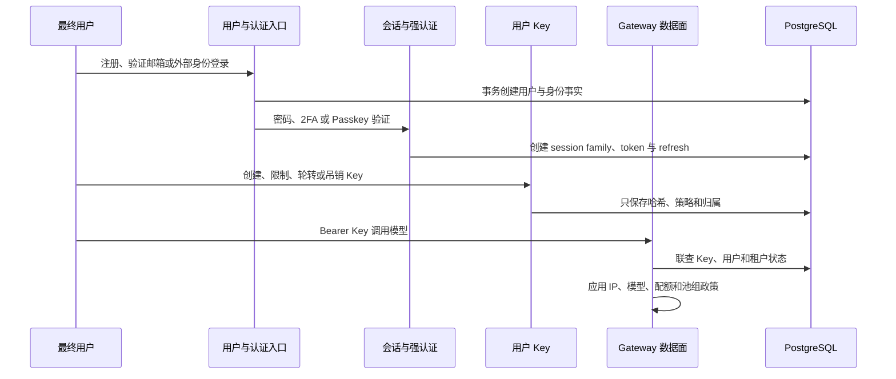

管理身份由 `platform_admin`、`tenant_operator` 和租户 scope 共同决定；最终用户始终是
`users.role='user'`。管理员令牌和管理员网页登录会话是两种凭据通道，不是两种新增角色。
Hermes 的 service principal 是内部机器主体，也不是第四种人类身份。

用户 Key 明文只在创建时返回一次。入站鉴权必须同时验证 Key、用户和租户状态，策略读取失败按
权限风险拒绝。吊销是终态，普通 PATCH 不得把已吊销 Key 重新激活；租户停用也必须同时切断
API Key 和既有网页登录会话。

### 5.5 模型和池组

模型目录回答“用户请求的名字是什么能力”；池组回答“这次能力由哪些账号提供”。

- `models` 与 `model_aliases` 定义 canonical model 和公开名字。
- `model_registry_capabilities` 定义模型能力。
- `model_pool_bindings` 把租户可见模型绑定到池组，并定义优先级、限额和 fallback class。
- `pool_groups` 定义池。
- `provider_accounts` 和账号池关系定义实际供给。
- `routes` 与订阅分组策略限制用户组能进入哪些池。

用户的一个 Key 能否调用多个模型，取决于 Key 的模型 allowlist、用户组、租户目录和这些模型
各自的池组 binding，而不是 Key 自己直接绑定一串上游 token。

路由候选必须同时满足租户、池组、模型、协议、账号能力、凭据、过期时间、健康和配额条件。
分组策略读取失败时必须拒绝，不能让普通分组临时进入本租户更高等级池。`disable_cooling` 等
运营覆盖项只有在查询、Selector 和状态写回三处都消费时才算生效；控制面有字段但 SQL 先过滤掉
候选，仍属于空心接线。

## 6. 资金与配额架构

### 6.1 余额层级

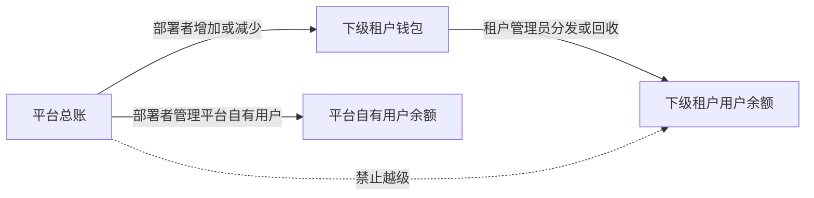

所有人工余额调整必须：

- 使用幂等键。
- 在事务中锁定相关钱包或用户余额。
- 检查可用余额，不能动用已 hold 的部分。
- 同时写双边 ledger entry，借贷和为零。
- 记录操作者、角色、原因、目标和时间。
- 保留不可静默修改的交易证据。

### 6.2 在线调用资金状态

```text
预测费用
  -> Reserve claim / hold
  -> 上游调用
  -> 成功：按真实用量 Settle
  -> 失败：Abort 释放
  -> 部分或累计补偿：Refund，累计不超过原始结算
  -> 结算失败：Settlement Intent + DLQ/Recovery
  -> 用户查询：Usage + Receipt + Dispute
```

在线主链的权威事实分为三层：

| 层 | 责任 | 失败合同 |
| --- | --- | --- |
| Claim 与余额 Hold | 保证同一请求只取得一次记账身份，并预留可用余额 | 不确定时拒绝出站 |
| 强配额 Reservation | 执行用户、Key、池组、模型、金额、token、请求数和并发限制 | 预留失败 fail-closed；终结失败进入持久恢复 |
| 分钟预算 | 执行 RPM/TPM 等短周期软限制 | 不是资金真相；临时故障可按明确政策降级，但必须可观测和自动收敛 |

请求成功后，结算必须在同一事务完成费用事实、余额变动、用量和槽位释放；上游失败必须中止
并释放 hold。退款支持部分退款和多次累计退款，但累计值不能超过原始结算。已向用户交付响应后，
本地结算失败不能把请求伪装成失败重放上游，而要写入 `settlement_intents`、DLQ 或同等恢复事实。

### 6.3 支付、订阅、兑换码与奖励

HUAKAI 当前主要依靠管理员手工余额、兑换码、订阅履约和奖励流转。代码中已经存在支付订单、
回调、履约、累计退款和用户收据，但当前没有生产级真实外部支付通道，因此：

- “订单退款”不等于已经调用支付提供方原路退回银行卡或钱包。
- 启用真实支付提供方之前，必须补提供方退款、退款查询、对账和中间态自动恢复。
- 当前发票域是文字收据，不是包含税务主体、税额、法定编号、红冲和 PDF 的正式发票系统。
- 不能为了未来支付场景改写当前已闭环的内部余额账本。

支付和订阅写接口必须服从三身份合同：部署者可处理平台租户用户和下级租户钱包，不得越级给
下级租户最终用户充值或授予订阅；租户管理员只能处理自己租户的用户。请求体中的 `tenant_id`
只是目标参数，不能替代认证上下文的角色和租户 scope。

兑换码只保存哈希，兑换动作必须受幂等、用户次数、总次数、有效期和防猜限制。全局关闭兑换后，
设置读取故障必须拒绝兑换，不能把“读取不到”解释成“继续开放”。

奖励效果必须有唯一业务事实。注册奖励和首单推荐奖励即使发生在主事务之后，也不能只打错误日志；
失败必须进入持久 outbox、DLQ 或可重扫事实，避免用户已成功消费但推荐人奖励永久丢失。

### 6.4 退款、争议与人工恢复

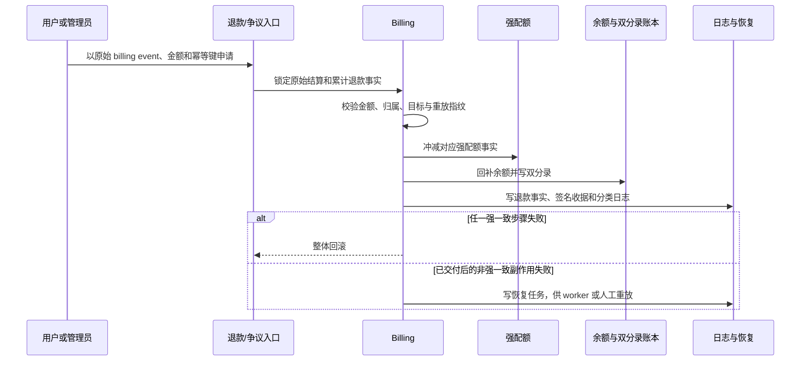

争议必须保存原始请求身份、账号、池组、模型、费用、操作者、理由和处理结果。普通运行日志按
30 天清理；退款、账本、争议金额、幂等效果和订单状态是永久业务事实，不属于可清理日志。

## 7. Hermes 运维助手

### 7.1 定位

Hermes 是部署者和获授权租户管理员的运维助手，不是最终用户聊天产品，也不是 HUAKAI 自研模型。
HUAKAI 使用官方 Hermes Runner，并向它提供受控的内部工具端点。

### 7.2 权限与隔离

- 公共管理入口为 `/v1/hermes/*`，始终经过 HUAKAI 管理员认证。
- 租户管理员必须有 `hermes_operations` capability，默认未授权。
- 租户管理员只能查看和操作自己的租户。
- 最终用户无入口。
- 官方 Runner 只能通过 `/internal/hermes/mcp` 调 HUAKAI 工具。
- Runner 无 PostgreSQL、Redis 和宿主端口访问。
- 外部 OpenAI 兼容模型 URL + Key 属于租户自己的 Hermes profile，并加密保存。
- 修改型操作必须经过提议、确认、并发/速率限制、事务和恢复记录。

### 7.3 Hermes 链路

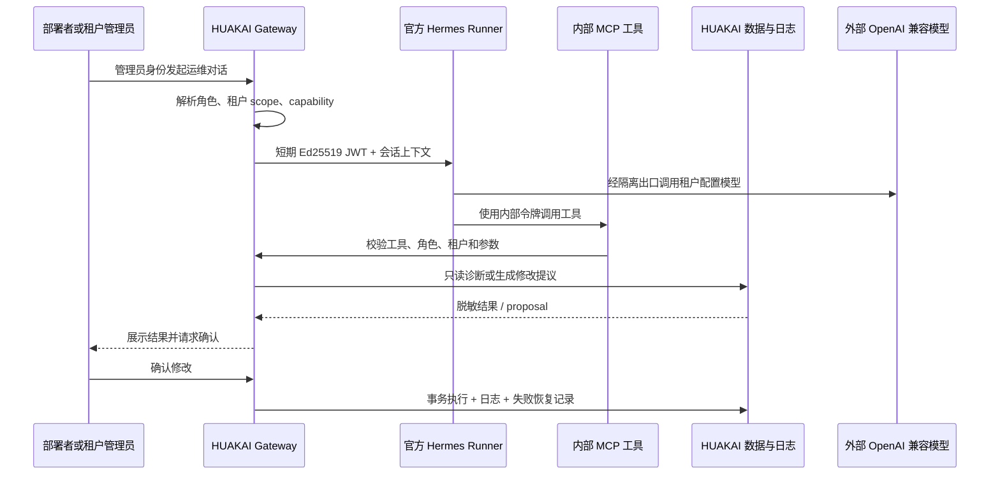

## 8. 生产部署拓扑

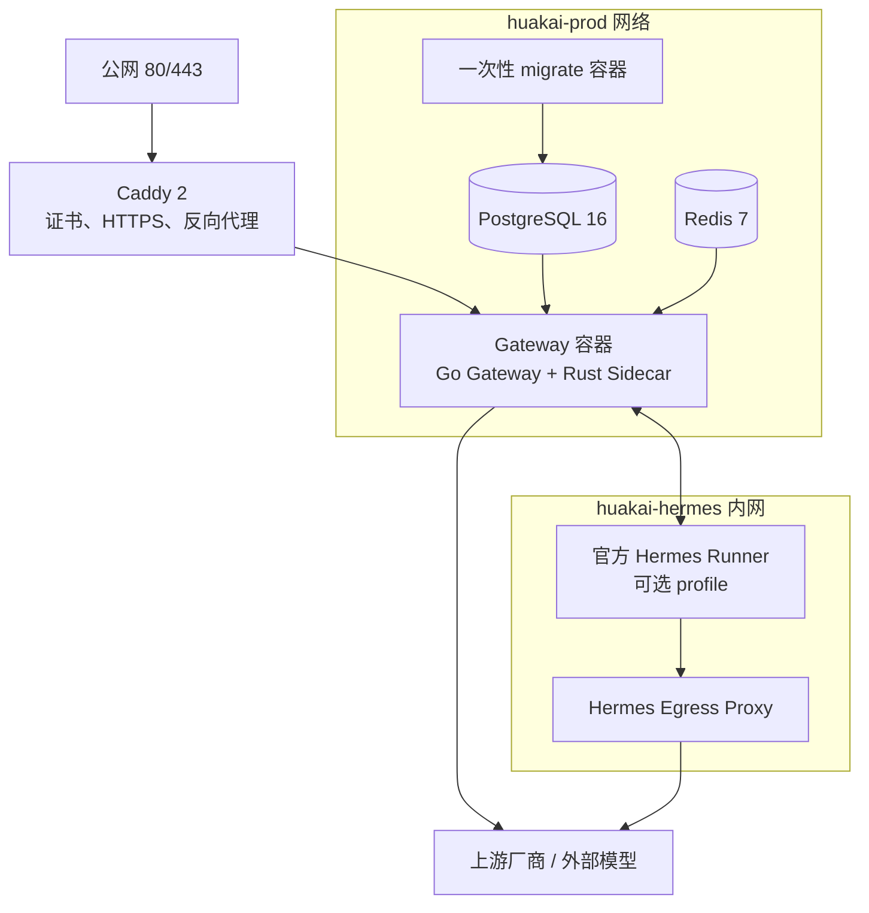

生产启动顺序：

1. PostgreSQL 和 Redis 健康。
2. `migrate` 把 schema 升到镜像要求的最新版本。
3. Hermes 密钥初始化器按严格权限复制密钥；未配置 Hermes 时允许无密钥退出。
4. Gateway 启动，校验 release mode、密钥、数据库、审计签名和关键配置。
5. Rust Sidecar 在同容器中提供 Unix Socket。
6. `readyz` 通过后 Caddy 才把公网流量转给 Gateway。
7. Hermes profile 只有显式启用时才启动 Runner 和隔离出口。

仓库同时提供两种入口拓扑：

- `backend/docker-compose.prod.yml`：由 Caddy 自动管理公网 HTTPS，适合单机直接部署。
- `backend/docker-compose.direct.yml`：Gateway 直接暴露给外部负载均衡器或既有反向代理，
  证书、HTTPS 和入口限流由外部设施负责。该模式不是开发配置，发布检查必须单独验证其信任代理、
  来源 IP 和健康检查合同。

停机顺序先把实例标记为 drain，再等待 HTTP 在途请求，随后停止结算、凭据、DLQ、outbox、
订阅、巡检、监测和日志 worker，最后关闭数据库，避免先停依赖导致在途请求丢账。

## 9. 技术栈

| 层 | 当前技术 | 在 HUAKAI 中的目的 |
| --- | --- | --- |
| 生产语言 | Go 1.25 | HTTP 数据面、控制面、worker、数据库和业务编排 |
| HTTP 路由 | `chi/v5` | 统一挂载模型、用户、管理和内部路由 |
| 数据库 | PostgreSQL 16 + `pgx/v5` | 多租户事实、账本、日志、幂等、租约、DLQ 和恢复 |
| 迁移 | `golang-migrate` / migrate 容器 | 应用启动前受控升级 schema |
| 共享短期状态 | Redis 7 | 多副本公网限流等非账本短期状态 |
| 精确金额 | `shopspring/decimal` | 费用、余额和退款，避免浮点误差 |
| TLS 特殊出口 | Rust 1.96、BoringSSL Sidecar | 特定客户端 TLS 形态的账号转 API 车道，并承载当前 CRS 安全源传输 |
| 入口 TLS | Caddy 2 或外部负载均衡器 | 自动证书模式，或由外部设施承担 HTTPS、反向代理和公网端口 |
| 可观测性 | Zap、slog 门面、Prometheus、OpenTelemetry | 分类日志、指标、追踪与运行时调级别 |
| 身份安全 | bcrypt、JWT、WebAuthn、TOTP/恢复码 | API Key、会话、管理员凭据和二次认证 |
| 协议内核 | HCSF/canonical + provider/client adapter | 跨 OpenAI、Anthropic、Gemini 等协议转换并记录损失 |
| 部署 | Docker 多阶段构建 + Compose | Go/Rust 单镜像、外部迁移、Caddy、PG、Redis 和可选 Hermes |
| 前端 | 尚未确定 | 当前仓库无可信前端源码，后续按本白皮书能力面重构 |

## 10. 核心数据域

149 张业务表按责任归入以下数据域：

| 数据域 | 核心事实示例 | 目的 |
| --- | --- | --- |
| 租户与用户 | `tenants`、`users`、`admin_tokens`、`session_*` | 三身份、登录、会话和租户隔离 |
| 客户 Key | `api_keys`、`api_key_groups` | 对外调用身份、策略、模型和池约束 |
| 上游账号 | `providers`、`provider_accounts`、`account_credentials` | 账号、凭据、订阅、额度和导入事实 |
| 模型目录 | `models`、`model_aliases`、`model_registry_*` | 模型名称、能力、租户可见性和快照 |
| 池与路由 | `pool_groups`、`model_pool_bindings`、`routes`、`sticky_bindings` | 供给组合、路由策略、粘性和并发 |
| 价格与余额 | `billing_*`、`user_balances`、`tenant_wallets`、`balance_ledger_*` | 预扣、结算、退款、租户分发和账本 |
| 配额与订阅 | `quota_*`、`subscription_*` | 时间窗、并发、套餐、续期和提醒 |
| 健康与监测 | `channel_health_*`、`server_monitor_*`、`alert_*` | 账号和服务器状态、告警和恢复 |
| 日志与证据 | `ops_runtime_logs`、`audit_ledger_entries`、各域 audit 表 | 操作、资金、安全、错误、访问和恢复证据 |
| 可靠性 | `outbox_events`、`dlq_events`、`settlement_intents` | 异步投递、失败重放和补账 |
| Hermes | `hermes_*` | profile、会话、工具调用、确认和修改恢复 |

PostgreSQL 是业务和恢复事实的唯一持久真相。内存缓存、Redis、进程内计数器和 runtime registry
不得成为钱、权限或租户归属的唯一来源。

## 11. 运行、日志与恢复

### 11.1 日志系统

产品层统一称“日志系统”。现存 `audit` 包、表和 API 字段属于技术标识符，不代表另一套并列产品。
任何模块新增日志都必须进入统一分类：

| 类别 | 典型内容 | 保留合同 |
| --- | --- | --- |
| 访问日志 | 入口、身份类型、租户、协议、模型、状态码、耗时 | 普通日志 30 天 |
| 操作日志 | 管理员动作、目标、前后状态、结果 | 普通日志 30 天；业务效果另存 |
| 安全日志 | 登录、2FA、Passkey、权限拒绝、凭据异常 | 普通日志 30 天 |
| 错误日志 | 稳定错误码、错误类别、重试性、影响对象 | 普通日志 30 天 |
| 恢复日志 | DLQ、outbox、对账、人工处置、最终收敛 | 普通日志 30 天；恢复任务本身按业务合同保存 |
| 资金证据 | billing event、账本、退款、订单、争议、幂等效果 | 永久业务事实，不执行 30 天清理 |

每条日志至少包含 `category`、`event_type`、`result`、`severity`、稳定错误类别、重试性、
恢复状态、租户和请求关联标识。秘密、完整凭据、Cookie、原始私钥和用户敏感正文不得进入日志。

### 11.2 健康、探测和账号状态

账号健康不是一个布尔值。现行状态来自请求反馈、401/403、429、额度耗尽、凭据刷新、主动探测、
模型发现、配额采集和人工操作。状态写入后必须同时影响：

```text
账号详情与列表
 -> 池组候选查询
 -> Selector 评分和拒绝
 -> retry/fallback
 -> 凭据刷新或重新认证
 -> 告警
 -> 自动恢复和人工恢复
```

真实探测会消耗上游成本，必须有账号级开关、成本预算、多副本租约和真实健康写入。普通用户请求
观测与主动探测必须使用不同时间事实，不能都写成 `last_probe_at`。管理员应能分别清除错误、
清除限流、重置配额、临时摘除和恢复状态；“强制 active”不能代替所有细粒度动作。

### 11.3 服务器监测

服务器监测采集 CPU、内存、磁盘、网络、进程、容器/cgroup 和节点身份。它服务部署者运维，
不读取业务凭据，不替代 Prometheus，也不把宿主敏感路径暴露给租户。租户管理员只能看到自身
业务作用域的服务状态，不得通过监测接口枚举平台宿主或其他租户。

### 11.4 DLQ、outbox、对账和人工恢复

失败恢复至少分四类：

1. **可安全重试**：有稳定幂等键，worker 可自动重放。
2. **需要重新选号**：当前账号失败但请求尚未产生不可逆副作用，受 retry budget 和 fallback 约束。
3. **上游已提交、本地不确定**：写孤儿或恢复事实，先查询和对账，不能直接重复提交。
4. **需要人工判断**：金额歧义、身份冲突、凭据归属冲突或不可判定状态，进入明确运营队列。

恢复记录必须能回答：原始动作、当前状态、最后错误、重试次数、下次时间、租约持有者、最终结果和
人工操作者。只打印一行错误但没有可领取事实，不算恢复能力。

### 11.5 后台任务与多副本原则

Gateway 启动后会运行凭据刷新、账单租约清理、结算意图清理、支付过期、Key 过期、
配额补偿、模型同步、告警评估、订阅到期/提醒/续期、每日巡检、媒体任务、服务器监测、
Hermes 消息清理、用量清理、日志清理、DLQ 和 outbox 等 worker。

统一要求：

1. 多副本任务需要数据库租约或可证明的幂等。
2. 启动即跑一次，再按周期执行，避免刚启动时等一个完整周期。
3. `context` 取消、ticker 停止和 worker drain 必须完整。
4. 钱和权限相关任务失败不能只写日志，必须进入可恢复事实。
5. 普通日志、Hermes 消息和同类运维数据统一按 30 天清理。
6. 清理任务必须分批，不能长事务锁死生产表。

## 12. 状态口径

以后任何功能只能使用以下状态，不得用“做了”“基本完成”混写：

| 状态 | 定义 | 必要证据 |
| --- | --- | --- |
| 已决策 | Owner 已明确产品或架构选择 | 决策记录或本白皮书确认项 |
| 已实现 | 生产代码存在且可编译 | 主线文件和提交 |
| 已接线 | 生产启动或路由实际可达，依赖真实注入 | wiring/route + 接线测试 |
| 已测试 | 判别式单元/集成测试真实运行并通过 | CI 或本地测试证据 |
| 活体验证 | 使用真实厂商账号或真实兼容服务跑通 | 脱敏的 E2E 记录 |
| 可上线 | 迁移、配置、容器、回滚/恢复、全链路发布门全部通过 | Release Gate |

状态只能向右推进。发现旧证据失效、上游变化或主线回归时必须降级，不能保留虚假完成状态。

## 13. 当前主线状态

### 13.1 已由源码确认

- Go Gateway、PostgreSQL、Redis、Caddy、Rust TLS Sidecar 的生产构建与 Compose 拓扑存在。
- 三身份所需的平台管理员、租户管理员、用户角色和租户 scope 基础存在。
- 用户管理主入口已限制部署者越级管理下级租户用户，余额账本区分平台到租户和租户到用户；
  但用户 Key 与争议处理仍有平台管理员可指定任意租户的旧路径，三身份边界尚未全局闭合。
- Chat 主链包含身份、模型、路由、预扣、选号、凭据、出站、结算、日志和恢复。
- OpenAI、Anthropic、Gemini 形态以及 embeddings、rerank、images、audio、video、
  Responses 和媒体任务入口已挂载；每个端点是否达到同等完整链路仍需逐项验收。
- Hermes 管理入口、内部 MCP、租户能力授权、会话、工具、确认和隔离部署存在。
- 运行日志、账号健康、服务器监测、告警、DLQ/outbox 和多类 worker 已有实现与接线。

### 13.2 不能由源码单独证明

- 所有厂商的所有模型都用真实账号跑通。
- 多账号轮询、跨账号切换和多池 fallback 在真实上游压力下稳定。
- 每个协议入口都与 chat 主链拥有完全一致的钱路、健康、错误分类和恢复。
- 当前主线可以直接上线。
- 未来前端已经覆盖全部管理和用户能力。

### 13.3 当前发布证据缺口

在本次源码基线中没有找到可复现、可关联到当前提交的完整发布证据，因此以下项目均为
“尚未证明”，不能写成已经通过，也不能仅凭源码存在断言一定失败：

- 可信前端尚未重构，当前没有前端发布证据。
- 真实账号 E2E 尚无按厂商、协议、模型和能力关联当前提交的完整矩阵。
- 生产迁移、全量 CI、两种入口拓扑的容器 smoke 和主线合并后验证缺统一发布记录。
- 逐协议、逐功能域的链路 parity 尚无覆盖全部入口的当前验收矩阵。

具体缺陷、复现步骤、根因、影响面和修复状态只记录在 GitHub Issue、PR、commit 和 CI，
不复制进白皮书。这样缺陷关闭后不会留下第二份过期状态表；白皮书只保留稳定架构与发布门。

## 14. 源码责任地图的维护合同

白皮书负责稳定产品能力、架构边界和承重构件，不把 1344 个 Go 生产文件逐个复制进正文。
机制、算法、状态机、事务和失败恢复由 `docs/HUAKAI工程设计手册.md` 展开；全量文件覆盖由
派生文档 `docs/源码责任索引.md` 承担。两者都必须由当前主线生产源码提取和人工复核，
不是另一份产品总纲。三者的关系是：

1. 白皮书定义稳定功能编号、完整链路、边界和影响维度。
2. 工程设计手册说明核心机制、算法、状态机、事务、幂等和失败恢复。
3. 源码责任索引把每个第一方生产 package 和文件归到这些功能编号。
4. package 文档、中文代码注释和类型命名解释局部实现意图。
5. GitHub Issue、PR、commit、CI 和 Release 记录具体改动过程。

测试文件不进入白皮书和生产文件责任表；测试策略和关键验收入口挂在功能条目下，避免把测试清单
冒充产品架构。

源码责任索引的每个 package 条目至少回答：

| 字段 | 含义 |
| --- | --- |
| package 路径 | 主线相对路径 |
| 生产文件 | package 内全部非测试第一方源文件 |
| 功能域 | 它服务哪项产品能力 |
| package 责任 | 这个 package 负责什么、不负责什么 |
| 存在目的 | 为什么应独立存在，或为什么应进入合并/清理候选 |
| 链路位置 | 入口、编排、领域、适配、存储、worker、恢复、测试或部署 |
| 输入与输出 | 主要调用方、被调用方、读写的事实 |
| 关键风险 | 身份、租户、钱、配额、凭据、并发、恢复、外部协议或普通 |
| 影响半径 | 修改错误会波及哪些角色、端点、数据表、worker、协议、厂商和恢复路径 |
| 验证入口 | 对应单测、集成测试、E2E、CI 或运行监测 |
| 核实状态 | 人工核实、源码提取待复核、待核实 |

### 14.1 功能条目合同

每项业务能力也必须有稳定条目，不能只列文件名。功能条目至少包含：

| 字段 | 含义 |
| --- | --- |
| 功能编号与名称 | 稳定 ID，不随文件移动而改变 |
| 用户结果 | 部署者、租户管理员或最终用户实际得到什么 |
| 使用角色与权限 | 哪个身份可读、可写，租户 scope 如何限制 |
| 对外入口 | HTTP 路由、后台任务、CLI、内部 MCP 或部署动作 |
| 完整调用链 | 从入口到持久化、出站、结算、日志和恢复 |
| 数据事实 | 读写的表、幂等键、锁、版本和保留周期 |
| 失败语义 | 何时拒绝、重试、换号、降级、进入 DLQ 或要求人工处理 |
| 运维入口 | 如何查看状态、诊断原因、执行恢复和验证结果 |
| 生产文件 | 实现该能力的全部承重文件，不只列 handler |
| 影响半径 | 改动会影响的角色、模块、协议、厂商、钱路与发布门 |
| 验证证据 | 单元、集成、E2E、CI、活体或运行监测 |
| 当前状态 | 已决策、已实现、已接线、已测试、活体验证或可上线 |

功能与文件是双向索引：

- 从功能出发，能找到所有承重文件和测试，防止修一个点漏掉整条链。
- 从 package 和文件出发，能找到它服务的功能和影响范围，防止删除、覆盖或重复实现。

### 14.2 稳定功能与支撑编号

编号描述的是产品能力或长期支撑责任，不绑定某个文件名。文件拆分、合并或移动时，编号保持不变；
新增平行实现不能擅自新造编号，必须先判断是现有能力的补全，还是确有新的用户结果。

| 编号 | 功能或支撑责任 | 主要结果 |
| --- | --- | --- |
| `CORE-001` | 共享核心能力 | 为多个业务域提供不适合归入单一功能的稳定基础合同。 |
| `SYS-001` | 网关启动与生命周期 | 加载配置、组合依赖、挂载路由、启动 worker、优雅停止。 |
| `IAM-001` | 管理身份与租户 scope | 区分部署者和租户管理员，阻止跨租户、越级管理。 |
| `IAM-002` | 用户注册、登录与会话 | 最终用户完成注册、验证、登录、续期、登出和会话管理。 |
| `IAM-003` | 强认证与外部身份 | 提供二次验证、Passkey、验证码和受控外部身份接入。 |
| `IAM-004` | 用户管理与通知 | 管理本作用域用户、邀请、状态和通知。 |
| `IAM-005` | HUAKAI 用户 Key | 创建、校验、限制、轮转、吊销和查询用户调用凭据。 |
| `IAM-006` | 高风险能力授权 | 部署者按租户显式授权高级账号接入、Hermes 等能力，默认拒绝。 |
| `ACC-001` | 上游账号生命周期 | 创建、查询、修改、暂停、恢复、复制和删除上游账号。 |
| `ACC-002` | 账号添加与凭据导入 | 将 OAuth、Cookie、Setup Token、CLI 文件、批量文本或迁移包识别为账号并安全落库。 |
| `ACC-003` | 凭据保险箱与轮转 | 加密保存凭据、版本化更新、刷新、续期和失效处置。 |
| `ACC-004` | 订阅档案与标签 | 识别套餐、订阅等级、到期时间和来源，形成可运营标签。 |
| `ACC-005` | 账号配额窗口 | 采集并统一投影 5h、7d 等窗口余额、重置时间和未知状态。 |
| `ACC-006` | 账号代理 | 管理代理、绑定、质检、回退、恢复和占用关系。 |
| `ACC-007` | TLS 指纹档案 | 管理需要仿真出站的账号指纹、选择和健康，不污染官方 Key 出口。 |
| `ACC-008` | 账号健康与恢复 | 汇总错误、限流、配额和探测信号，执行细粒度摘除、冷却、恢复和人工操作。 |
| `MODEL-001` | 模型目录与发现 | 维护规范模型、别名、账号可用模型、厂商目录和模型同步。 |
| `ROUTE-001` | 池组与账号绑定 | 将账号放入租户可用池组，维护组内关系和授权边界。 |
| `ROUTE-002` | 路由、选号与回退 | 按模型、池、健康、配额、优先级、粘性和重试预算选择上游。 |
| `ROUTE-003` | 请求政策与防护 | 执行参数、模型、内容、速率和分组政策，政策读取失败时不越级放行。 |
| `API-001` | Chat Completions | 提供聊天补全的同步和流式入口。 |
| `API-002` | Legacy Completions | 提供文本补全兼容入口。 |
| `API-003` | Embeddings 与 Rerank | 提供向量和重排能力入口。 |
| `API-004` | 图片 | 提供图片生成、编辑或兼容任务入口。 |
| `API-005` | 音频 | 提供语音合成、识别等音频入口。 |
| `API-006` | 视频与媒体任务 | 提交、轮询、取消和恢复视频或异步媒体任务。 |
| `API-007` | Responses | 提供 OpenAI Responses 兼容入口。 |
| `API-008` | Anthropic Messages | 提供 Anthropic Messages 兼容入口。 |
| `API-009` | Gemini | 提供 Gemini 原生和兼容入口。 |
| `API-010` | 模型查询 | 返回当前身份、Key 和池组实际可调用的模型视图。 |
| `UP-001` | 规范请求与协议适配 | 将多入口请求归一化，并在上游和客户端协议间转换。 |
| `UP-002` | 厂商 adapter | 封装厂商能力、端点、鉴权、模型和错误语义。 |
| `UP-003` | 出站与 TLS Sidecar | 选择标准 TLS、账号代理或特定仿真车道并执行网络出站。 |
| `UP-004` | 流式传递 | 解析、扫描、计量、透传和中断恢复流式响应。 |
| `MONEY-001` | 定价 | 解析模型、工具、图片、音频等价格并形成可版本化计价输入。 |
| `MONEY-002` | 预扣、结算、退款与补账 | 在调用前保留额度，按真实用量结算，多次补偿不重复记账。 |
| `MONEY-003` | 三身份余额账本 | 区分平台到租户、平台到自有用户、租户到本租户用户的余额动作。 |
| `MONEY-004` | 配额与预算 | 执行请求、令牌、金额、窗口和预算限制。 |
| `MONEY-005` | 订阅、支付与发票 | 管理平台订阅合同、人工或外部付款事实和发票。 |
| `MONEY-006` | 兑换码、推荐与签到 | 通过受控业务事件发放或回收余额奖励。 |
| `OPS-001` | 日志 | 统一记录访问、管理动作、资金事实、安全事件和错误分类。 |
| `OPS-002` | 指标与用量分析 | 暴露运行指标、调用趋势、延迟、错误率和用量投影。 |
| `OPS-003` | 健康、探测与告警 | 发现账号、通道和服务异常并形成可处置信号。 |
| `OPS-004` | 服务器监测 | 采集 CPU、内存、磁盘、网络、进程和节点状态。 |
| `OPS-005` | DLQ、outbox 与恢复 | 保存未完成副作用，支持租约、重试、对账和人工恢复。 |
| `OPS-006` | 保留、导出与备份 | 执行 30 天日志清理、受控导出、备份和恢复验证。 |
| `OPS-007` | 模块与平台设置 | 管理运行模块、平台配置、控制动作和运维视图。 |
| `HERMES-001` | 官方 Hermes 运维助手接入 | 让部署者和获授权租户用官方 Hermes 查询本作用域信息并执行受控简单操作。 |
| `DATA-001` | 数据库合同 | 以迁移和查询源维护表、约束、索引、事务和回退合同。 |
| `BUILD-001` | 构建、CI 与部署 | 构建镜像、运行迁移、启动依赖、执行发布门和部署验证。 |

第 2 至 12 章是当前稳定行为合同，分别约束身份、模型调用、账号接入、资金、Hermes、部署、
数据、日志和恢复；OpenAPI、迁移、查询源和判别式测试是对应的可执行合同。上表是这些合同的
稳定导航编号，不等于能力已经达到“可上线”，也不要求为每个编号再复制一份容易过期的文档。

某项改动在上述合同中没有明确条款时，必须先在当前 Issue 或 PR 写清正常、失败、并发、幂等、
恢复和运维验收，再修改实现。不得把“没有单独规格文件”解释成可以删除、弱化或重写现有能力；
旧 `docs/specs` 的历史 `Released` 声明不再作为当前事实，真实行为仍需从主线源码、迁移、测试和
运行证据反向核实。

### 14.3 完整性证明

功能与文件不是一对一关系，而是受控的多对多关系：一个功能通常跨入口、领域、存储、worker
和恢复文件；组合根、共享 adapter 或账本文件也可能服务多个功能。验收时不强造错误的一对一，
而是证明两个方向都闭合。

源码侧必须满足：

1. 以目标主线提交的 `git ls-files`、Go 语法解析、Cargo workspace 和生产构建链生成第一方生产文件全集。
2. 全集中每个生产文件在源码责任索引恰好出现一次。
3. 索引不得有不存在路径、重复路径或未说明的额外条目。
4. 每个第一方生产 package 至少关联一个功能编号；生成代码按 SQL/生成器合同归组，第三方依赖、
   测试和一次性开发工具不进入生产责任索引。
5. 生产文件总数、索引唯一文件数和已分类文件数必须相等。

功能侧必须满足：

1. 每个功能至少关联一个真实生产入口和生产文件。
2. 涉及持久状态时必须列出 schema/查询和恢复方式。
3. 涉及外部调用时必须列出 adapter、transport、凭据和错误分类。
4. 涉及钱、权限、租户或配额时必须列出拒绝路径和判别式测试。
5. 功能状态不得高于它最弱的必要环节；例如有 handler 但未挂 route，只能算已实现，不能算已接线。

最终校验输出至少包含：

```text
生产文件全集数量       = N
源码索引唯一文件数量   = N
已关联功能的文件数量   = N - 明确分类的非业务文件数量
不存在路径             = 0
重复路径               = 0
未分类孤儿文件         = 0
无生产入口的功能       = 0
无验证证据的高风险功能 = 0
```

只要任一等式或零值不成立，源码责任索引就不能标记完整；白皮书中相关功能状态也必须标为待核实，
不能靠手工补数字假装完成。

源码责任索引按以下顺序建立：

1. 生产入口与组合根：`backend/cmd/*`。
2. 身份、租户、用户与 Key。
3. 模型目录、Router、Pool、账号与凭据。
4. 协议、Provider、Transport 和 Rust Sidecar。
5. Billing、余额、退款、配额、订阅和支付。
6. 日志、健康、告警、服务器监测、DLQ/outbox 和恢复。
7. Hermes。
8. PostgreSQL 查询包、迁移、部署脚本、CI 和工具命令。
9. 从功能条目记录验证策略和关键判别式测试入口，但不在白皮书逐个罗列测试文件。

不能从源码证明责任的文件标记为“待核实”，不能为了填表编造用途。确认无调用、无运行入口、
无测试且无强制路线的文件，进入删除候选；删除仍需检查引用和能力缩水。

## 15. 工程开发流程

### 15.1 单目标、单写入者、单 PR

1. 一个目标在同一时间只有一个 Owner 指定的写入负责人。
2. 其他 AI 或人员可调查、复现和审查，但默认只读。
3. 角色不永久固定；下一个目标可以重新指定。
4. 实现分支必须从最新 `origin/main` 创建。
5. 主线只接收 PR，不直接改。
6. 一个目标只保留一个当前 PR；旧 PR 的有效能力先核实是否已被主线或当前 PR 吸收，再关闭。
7. 未经 Owner 明确同意不合并。

### 15.2 正常开发闭环

```text
Owner 目标
  -> 主线同步
  -> 源码与外部行为证据核实
  -> 影响面和爆炸半径
  -> 小而闭环的实现
  -> 判别式测试
  -> 独立审查
  -> PR
  -> Owner 同意
  -> 合并主线
  -> 主线再测试
  -> 更新白皮书状态与源码责任地图
```

### 15.3 缺陷全生命周期

普通 Bug 不再新建零散 Markdown。唯一闭环是 GitHub Issue + PR + 回归测试：

- Issue：现象、复现、期望、真实根因、影响链和严重度。
- PR：修了什么、为什么、修改文件、爆炸半径、兼容性和测试证据。
- 回归测试：必须能在删除修复或注入旧缺陷时转红。
- 合并后：在最新主线重跑相关链和发布门。
- 重大资金、安全、数据丢失或生产事故才单独写 RCA。

### 15.4 由点到面

发现一个问题时，至少沿以下方向扩展：

```text
入口
 -> 身份与租户
 -> 模型与路由
 -> 池组与账号
 -> 凭据与出站
 -> 协议与响应
 -> 计费与配额
 -> 日志与证据
 -> 重试、DLQ 与人工恢复
 -> 管理入口与前端可运维性
 -> 同类协议、同类厂商和兄弟模块
```

成熟项目具备而 HUAKAI 缺失的有效能力，必须进入实现、Safe Equivalent、Plugin、
Feature Flag 或 Mandatory Roadmap，不能静默丢弃。

## 16. 发布门

一个版本只有同时通过以下门才可标“可上线”：

- 主线代码、迁移和部署配置同一提交。
- Go 单元、race、integration_pg、Rust、迁移 round-trip 和容器 smoke 通过。
- 钱、鉴权、租户、配额、凭据和日志测试具有判别力。
- 真实账号按厂商、协议、模型和能力完成 E2E，敏感信息不入日志。
- 多账号切换可用真实账号 + 行为等价 mock 验证；单真实号不能伪称证明多账号。
- sidecar 故障、数据库故障、Redis 故障、上游 401/429/5xx、流中断和结算失败均有预期结果。
- 管理员能看到问题、分类、影响账号、恢复动作和结果。
- 30 天日志清理、备份、恢复、drain 和多副本租约经过验证。
- OpenAPI、实际路由和前端调用合同一致。
- Owner 明确批准合并和发布。

## 17. 文档治理

白皮书确认后，它是项目级唯一总纲。其他文档只允许以独立用途存在：

- 工程设计手册。
- 源码责任索引。
- OpenAPI/协议合同。
- 数据库迁移本身。
- 现行运维手册。
- 当前尚未完成的单一执行计划。
- 未关闭的重大事故 RCA。

以下内容不得长期保留：

- 已完成目标的临时计划。
- 已被主线推翻的审计报告。
- 与白皮书重复的项目 Brief、总架构和阶段计划。
- 只为一次 AI 会话创建的进度文档。
- 已被新版本取代但仍声称有效的规则和记忆。

旧文档删除必须逐类进行：先确认白皮书已吸收有效事实，再检查代码和 CI 引用，再删除并修复链接。
不建立“归档垃圾场”；确有历史取证价值的内容由 Git 保留。

## 18. 稳定架构决策

本节只列已经由 Owner 或主线结构明确确认、需要长期遵守的决策。仍有争议的方案放 Issue 或当前计划，
不能偷偷写成既定事实。

| 决策 | 现行选择 | 直接后果 |
| --- | --- | --- |
| 事实存储 | PostgreSQL 是权限、钱、凭据版本、租户、恢复和业务效果的权威事实 | Redis 和内存只能承载可重建短期状态 |
| 迁移 | 发布前由一次性 migrate 任务升级，Gateway 不与多个实例竞争生产迁移 | 迁移失败阻止新版本接流量 |
| 身份 | 只有部署者、下级租户管理员、最终用户三种人类身份 | “代理”等称呼不能生成第四套权限模型 |
| 资金层级 | 部署者调下级租户钱包，租户管理员调本租户用户；部署者不得越级调下级租户用户 | 所有支付、订阅、兑换和人工调整入口必须复用该边界 |
| 路由 | 用户 Key 经模型目录和池组 binding 间接取得上游账号 | Key 不直接持有上游凭据 |
| 出站 | 官方 Key 与普通兼容上游走标准 TLS；明确需要客户端形态的账号模式走 Rust mimicry；CRS 安全源传输当前也复用 Sidecar | 统一 Dispatcher 不等于所有推理流量统一进 Sidecar，Sidecar 当前仍是全局启动与就绪依赖 |
| 控制面 | 管理 CRUD 必须成为热路径真实读取的事实 | 只有字段、按钮或表但无消费者视为空心能力 |
| 日志 | 产品统一称日志系统；普通日志保留 30 天，资金业务事实永久保留 | 技术包名可保留，运营口径不能再分裂 |
| Hermes | 使用官方 Runner；HUAKAI 只提供租户隔离的工具、确认、限制和恢复 | 最终用户无入口，Runner 无数据库和宿主访问 |
| 前端 | 当前旧前端不可信，按后端真实能力重新设计 | 后端状态不能因旧页面缺按钮而被误判不存在 |
| 研发 | 最新主线建功能分支，单目标单 PR，Owner 批准后合并 | 历史计划和旧 PR 不能继续形成平行真相 |

长期决策发生变化时，在 Issue/PR 中记录背景、选项、决定和后果，并在同一变更中更新本表。
Issue/PR 保存历史证据，白皮书只保留当前选择，不再在主线维护第二套 ADR 现状。

## 19. 已知风险与技术债

| 风险 | 当前控制 | 尚缺什么 |
| --- | --- | --- |
| 项目体量大、重复实现 | codebudget、单目标 PR、源码责任索引、独立 review | 存量大包保持稳定，新功能进入内聚子包，避免继续膨胀 |
| 控制面空心接线 | 功能条目要求从写入追到热路径 | 继续用判别测试证明配置确实改变运行结果 |
| 多副本后台任务重复 | 部分 worker 已使用数据库租约和幂等 | 启动即跑、租约和停止语义尚未全局一致 |
| Hermes 多副本预算 | 修改动作有单实例并发、速率、事务和确认边界 | 并发与速率仍是进程内预算，集群总量会随副本数放大 |
| 交付后资金副作用失败 | settlement intent、DLQ、账本与对账 | 各资金副作用继续补崩溃恢复和人工对账验收 |
| 账号状态恢复部分完成 | 账号恢复先提交，渠道恢复失败会显式返回部分完成 | 运维端需展示部分完成并支持安全重试收敛 |
| 出站边界扩大 | 标准 TLS 与 mimicry 有模式矩阵 | 持续验证启动门、readiness 与真实账号模式一致 |
| TLS profile 健康误读 | 周期校验 profile 字段并标记结构漂移 | 仍缺真实目标握手和上游接受度证据 |
| 文档陈旧 | 主线只保留本白皮书、源码索引、现行手册和机器合同 | 合并后继续由 CI 检查失效链接和重复状态文档 |
| 真实厂商漂移 | 模型同步、账号发现、健康与 issue 调研规则 | 缺完整按厂商/协议/模型的持续活体矩阵 |
| 灾难恢复 | 有备份 manifest 和 schema 事实 | 尚无正式备份脚本、RPO/RTO 和隔离恢复演练 |

### 19.1 代码架构健康度

**结论：宏观分层合理，局部组织不合理，当前属于“主链可继续建设，但必须停止热点包
继续膨胀”的阶段。**

合理部分：

- 生产入口、控制面、数据面、资金面和运维面已经能从组合根追到领域包、数据库和恢复任务；
- PostgreSQL/sqlc 承担持久化真相，Redis 只承担缓存、限流和瞬态协调，没有成为第二账本；
- 协议、Provider、账号池、凭据、结算和恢复已有独立领域包；Rust Sidecar 没有接管全部推理，
  但当前还承载 CRS 安全源传输并参与全局启动与就绪；
- OpenAPI、迁移、判别测试、模块探针和容器门提供了可执行合同，不再只靠设计文档声称完成。

当前结构债来自最新主线源码统计：

| 热点 | 当前体量 | 判断 | 主要风险 |
| --- | ---: | --- | --- |
| `internal/gatewayhttp` | 9223 行 / 19 个生产文件 | 超过包体量预算 | chat、认证和部分管理入口仍共享包级依赖，改一个入口容易扩大编译与回归半径 |
| `internal/proto` | 7480 行 / 34 个生产文件 | 行数和文件数双超预算 | 新协议容易继续堆在顶层，canonical 与厂商细节边界漂移 |
| `backend/cmd/gateway` | 9056 行 / 46 个生产文件 | 组合根过重，且不受现有 internal 包预算覆盖 | 启动门、依赖装配、worker 和路由修改互相冲突，AI 容易漏接或覆盖 |
| `internal/credentialacq` | 5910 行 / 19 个生产文件 | 接近预算上限 | 新厂商导入继续增加时会再次形成平行流程 |
| `internal/billing` | 5771 行 / 20 个生产文件 | 接近预算上限 | 钱路修改的审查和回归半径过大 |
| `internal/payment` | 5759 行 / 20 个生产文件 | 接近预算上限 | 订单、回调、退款和奖励容易共享过多存储细节 |
| `internal/gateway` | 5717 行 / 20 个生产文件 | 接近预算上限 | 转发、重试、错误和流恢复继续耦合 |

包总数不是首要问题。339 个 Go 包中，大量是按 HTTP、领域、Provider、协议和 sqlc 查询边界
拆出的内聚包；只要依赖方向清楚，小包有利于限制影响半径。当前真正的集中风险是组合根：
`cmd/gateway` 直接依赖 255 个包，完整依赖闭包为 741 个包，`wiring.go` 单文件 2220 行，
`routes.go` 单文件 1223 行。任何新增模块都必须同时修改这些高冲突入口，容易出现“代码存在但
未注入、已注入但未挂路由、worker 建了但没启动”的空心接线。

主线存在 21 组重复的 Go 短包名，共涉及 47 个包，主要来自 `internal/<domain>` 与
`internal/db/<domain>`、`internal/provider/<vendor>` 与 `internal/proto/<vendor>`。
Go 以完整 import path 区分它们，所以不会直接造成编译或运行冲突；风险在于组合根中需要频繁
起别名，人工或 AI 容易把领域包、生成查询包、协议包和 Provider 包读混。现有分层同名可以
保留，但新代码必须使用表达职责的显式 import alias，禁止再增加无层级语义的同名包。

治理方式：

1. 当前不启动大文件或大包的专项重构，也不把顺手拆分混进普通 Bug PR。
2. 修复存量缺陷时只做最小必要改动，用判别测试覆盖相关链路，避免为了结构漂亮扩大风险。
3. 新功能优先进入职责清晰的新包或子包；组合根只增加最薄的依赖注入、路由和生命周期接线。
4. 只有新能力确实需要、关键缺陷无法安全修复，或 Owner 单独立项时，才对热点做有测试保护的
   局部拆分；钱路、鉴权和 schema 拆分必须补 PostgreSQL 与恢复验证。
5. `exploratory/rust-core-gateway` 的非生产历史 lane 也不在本轮清理；以后单独核实生产引用、
   CI 和构建边界后再决定。

因此，架构健康度用于约束后续新增代码，不是要求现在重写存量。codebudget 继续阻止热点失控，
但不得为了通过预算而抬高 baseline，也不得为了“治理”制造一轮高风险无功能重构。

## 20. 术语

| 术语 | 本项目含义 |
| --- | --- |
| 部署者 | 系统所有者，管理平台工作租户和下级租户钱包 |
| 下级租户 | 租用部署者部分能力的独立经营作用域，不是第四种代理身份 |
| 租户管理员 | 下级租户的管理身份，只管理自身租户 |
| 最终用户 | 持有 HUAKAI 用户 Key 并消费模型能力的人 |
| 用户 Key | HUAKAI 签发的入站 API Key，不等同于上游官方 Key |
| 上游账号 | 可被池组选中的厂商账号或官方 Key 载体 |
| 账号模式 | `api_key`、OAuth、Session、Cookie 换取凭据等具体认证形态 |
| 模型目录 | 规范模型、别名、能力和租户可见性的事实 |
| 池组 | 一组可为模型提供服务的上游账号及其关系 |
| Binding | 模型、池组或账号之间带租户和优先级的显式关系 |
| Claim | 一次用户请求的稳定记账与幂等身份 |
| Hold | 上游调用前暂时冻结的可用余额 |
| Settlement | 按真实用量完成费用、余额、用量和槽位收敛 |
| 强配额 | 资金或权益相关、失败必须拒绝的配额事实 |
| 预算 | RPM/TPM 等短期软限制，不是资金权威 |
| Mimicry | 只为特定账号模式提供的客户端 TLS 形态仿真 |
| Sidecar | 与 Go Gateway 同镜像、经 Unix Socket 服务 mimicry 的 Rust 进程 |
| DLQ | 保存可重放失败副作用的持久队列 |
| Outbox | 与业务事务共同提交、随后异步交付的持久事件 |
| 孤儿 | 上游副作用可能已发生，但本地终态不确定的任务 |
| 活体验证 | 使用真实账号或真实兼容服务跑通脱敏 E2E |
| 可上线 | 代码、迁移、部署、测试、活体、恢复和运维门均通过 |
