# Claude OAuth/session 官方直发运行逻辑

状态：R1A S1 实现态（待 Owner/Claude 亲检与真实账号灰度）  
协议族：`anthropic_claude_session`  
安全边界：只允许 `OfficialDirect` 或 `Reject`；不启用 `RewriteRequired`。

## 1. 模块协作图

```mermaid
flowchart LR
    A[入站 /v1/messages] --> B[鉴权与请求校验]
    B --> C[Billing claim Reserve]
    C --> D[Quota Reserve / per-key 并发槽]
    D --> E[Registry + RoutePlan]
    E --> F[Pool selector]
    F -->|family 精确过滤| G[账号并发槽 + acquisition token]
    G --> H[Credential vault 物化]
    H --> I[family/vendor/auth/runtime 二次校验]
    I --> J{严格官方判据}
    J -->|OfficialDirect| K[最终 Anthropic body 克隆]
    J -->|Reject| X[detached Abort]
    K --> L[OAuthSessionAdapter]
    L --> M[官方 endpoint + beta 三态]
    M --> N{上游结果}
    N -->|非流 JSON| O[Anthropic response adapter]
    N -->|流式| P[SSE scanner + Anthropic event adapter]
    N -->|本地过期/401| Q[Abort + exclude A + hot refresh]
    Q -->|auth 子预算尚可| F
    O --> R[HCSF/client response]
    P --> R
    R --> S[Billing settle 一次]
    S --> T[Quota settle + slot release]
    X --> U[Quota release + slot release]
```

## 2. 数据与状态传递

| 阶段 | 输入 | 产生/更新的状态 | 下游必须消费的字段 |
| --- | --- | --- | --- |
| claim 预留 | tenant、API key、模型、幂等键 | `claim_id=reserving`、balance hold | selector、settler、quota 都使用同一 claim |
| quota 预留 | claim、user/key/pool scopes | quota reservation、per-key concurrency slot | settle/abort 必须分别 finalize/release |
| 选号 | pool、model、`ProtocolFamily`、excluded | account id、acquisition token、账号并发槽 | vault 与 settle 使用同一 account/token |
| 凭据物化 | tenant、account id | OAuth access token 或 session token；vendor/auth mode | compatibility 与 adapter 必须精确匹配 |
| 官方门 | request headers、path、最终入站 body | `OfficialDirect` 或 `Reject` | 只有前者能进入 dispatcher；没有第三种 raw allow |
| 出站 | family、account、credential、body | Bearer 请求；默认官方 URL 合并 `beta=true` | response/SSE 按同一 family 取 adapter/scanner |
| attempt 失败 | typed error、是否已交付字节 | abort reason、excluded account、refresh intent | 交付前才允许换号；交付后禁止重放 |
| 成功结算 | usage、account、attempt seq | claim committed、usage/billing event、quota settled | 每个逻辑请求只允许一次正结算 |

## 3. 关键配合点

1. `models.protocol_family`、默认 provider registry、pool vendor、response adapter、SSE scanner、HCSF marshal 与 admin catalog 必须同时认识 session family。R0 闭合闸对任一站缺失都返回 `not_ready`。
2. 选号 SQL 只按 provider family 精确过滤，不读取 credential auth mode。因此管理端写入前拒绝 API key，vault 物化后还要二次校验 vendor/auth/runtime；两层缺一都会让错号有机会发网。
3. pool selector 获取账号槽后会把 acquisition token 锚到 claim。此后的 client gate、adapter、transport 或解析失败都必须走 detached abort，不能使用已取消的请求 context 释放资源。
4. 本地 `expires_at` 过期属于交付前 auth failure：A 先 abort/release，再加入 excluded 并异步刷新；最多消费一次 auth-failover 子预算。它不写普通 5xx channel-health 降级。
5. 热刷新有进程内 tenant+account 去重窗口，worker 侧另有账号级持久化并发控制。并发请求可同时发现过期，但只允许一次实际刷新下沉。
6. **官方门是启发式形态门(2026-07-10 codex REJECT 后重写)**,不是不可伪造鉴真。判据:`POST /v1/messages`;UA 锚定 `claude-cli/<semver>` 前缀 + 宽入口后缀 `(external, <入口>)`(cli/cli-bg/IDE/SDK/裸 UA 均接受);`X-App∈{cli,cli-bg}` 且拒冲突重复;Stainless 核心头(lang=js/runtime=node/package semver/retry 非负);`anthropic-version` 属受支持集合;body 只要求 `model+非空 messages+整数 max_tokens>=0`。**system/metadata/beta/os/arch/timeout/helper 一律可选**——真实 2.1.199 的 cli-bg/IDE 入口与探测、501 后回退计数请求都不带全字段,强制全带会误拒。`X-Client-Name` 等自报字段不参与判定。form 通过≠授权:访问控制由 API key 认证 + tenant 隔离 + model allowlist + 凭据状态 + 限流独立完成(无 per-账号 ACL)。
7. `OfficialDirect` 进入时先克隆原 body 再做 JSON 校验;raw stream/raw buffered/默认 HCSF 非流路径发网前都再次克隆。请求侧用显式 `OfficialDirect` 标记走字节等价直发,**但当 public alias≠上游 provider model 时仍会定点改写顶层 `model`**(否则上游未知模型),alias==上游 model 时保持字节等价;除该 model 改写外不做 body controls / canonical 重排。session family 不运行既有身份改写。
8. count_tokens 端点当前返 501(Mandatory Roadmap);Claude Code 501 后回退到 `/v1/messages`(max_tokens=1、常无 system),该回退请求由上面放宽的 MessagesCore 门放行。cache-control 上限等协议约束若违反应返协议 400,不再由官方门伪装成 403。
9. 官方 endpoint 的 query 规则为：缺省或显式 true 加 `beta=true`，显式 false 不加；自定义 endpoint 缺省不加，只有显式 true 才加；已有 beta 值不覆盖、不重复。
10. `count_tokens` 不在 R1A。messages ready 不能推导 count_tokens ready；既有路由遇到 session family 会在选号、发网和钱账前显式 501，后者保持 Mandatory Roadmap。

## 4. 失败、并发与恢复

| 场景 | 必须发生 | 禁止发生 | 判别测试 |
| --- | --- | --- | --- |
| A 本地过期、B 有效 | A abort/quota release/slot release/refresh/exclude；B settle 一次 | A 发 HTTP、A 普通健康降级、A/B 双结算 | `TestClaudeSessionLocalExpiryReleasesARefreshesAndSettlesBOnce` |
| 同一 A 被 32 个请求同时判过期 | 去重层只下沉一次刷新 | 刷新风暴 | `TestClaudeSessionLocalExpiryHotRefreshConcurrentDedupe` |
| adapter 缺失 | 零 HTTP、billing abort、quota release | claim/slot 悬挂 | `TestClaudeSessionMissingAdapterReleasesWithoutHTTP` |
| 伪造 UA/X-Client | Reject，返回体不携带 raw body | raw pass-through | `TestDecideWithBodyAnthropicIsClosedTwoState` |
| per-key concurrency 饱和 | 同时成功数精确等于策略 cap，额外请求 deny | 超 cap | `TestPostgresStore_AcquireConcurrencySlot_ExactLimitUnderConcurrentRace` |
| 账号槽饱和 | 排队或稳定拒绝；settle/abort 后容量恢复 | `in_flight_count` 超 cap 或不归零 | `TestAccountSlotConcurrencyE2E_NoCapacityAndRelease` |
| 流中断 | 已交付字节后不换号；按实际交付只终结一次 | 重放导致重复内容/重复扣 | 既有 `TestAT_GW_002_03_PreStreamRetryAnd13MidStreamRetryBlocked` |

## 5. 三镜行为对照与 HUAKAI 取舍

以下“观察”来自独立 specifier lane 的 source-cited 计划；本实现 session 没有重读镜像源码。

| 主题 | 观察 | HUAKAI 取舍 |
| --- | --- | --- |
| body/HTTP 边界 | CLIProxyAPI 的已读区域把 OAuth body 准备、固定 query 与 HTTP 构造放在同一供应商执行边界。<router-for-me/CLIProxyAPI@26d45fd46a2d2911adef14772465131066dae465:internal/runtime/executor/claude_executor.go:266-290,1829-1957> | 不复制其结构；HUAKAI 保留 HCSF/dispatcher 分层，只把最终 body 克隆作为单一接缝。 |
| 官方判据 | CLIProxyAPI 的已读自动分支使用 UA 前缀，属于较弱信号。<router-for-me/CLIProxyAPI@26d45fd46a2d2911adef14772465131066dae465:internal/runtime/executor/helps/cloak_utils.go:39-56> | 不采用 UA-only；伪 UA 在 S2 前必须 Reject。 |
| 官方判据 | sub2api 的已读 messages 路径组合 UA、system、应用/版本/beta 头与 metadata。<Wei-Shaw/sub2api@12d811bd76572836d6df6e1fa8aa5ff91be3b12e:backend/internal/service/claude_code_validator.go:67-145> <Wei-Shaw/sub2api@12d811bd76572836d6df6e1fa8aa5ff91be3b12e:backend/internal/handler/gateway_helper.go:24-59> | 采用“多独立信号”的行为目标，判据与理由字面量由 HUAKAI 自行定义。 |
| beta query | CLIProxyAPI 与 sub2api 的已读默认 OAuth messages 地址都带 `beta=true`。<router-for-me/CLIProxyAPI@26d45fd46a2d2911adef14772465131066dae465:internal/runtime/executor/claude_executor.go:271-290> <Wei-Shaw/sub2api@12d811bd76572836d6df6e1fa8aa5ff91be3b12e:backend/internal/service/gateway_service.go:30-38> | 官方默认加；operator 显式 false 可关。 |
| beta query | new-api 的已读 Anthropic API-key 路径把 query 作为请求/渠道可选设置，不是无条件默认。<QuantumNous/new-api@246d62aa5ed3ba2a4728322c269c180a016dc9cd:relay/channel/claude/adaptor.go:44-70> | 自定义 endpoint 只在显式 true 时加，保护 operator contract。 |
| 刷新与换号 | CLIProxyAPI 的已读管理循环把单凭据刷新预算与换凭据重试分开。<router-for-me/CLIProxyAPI@26d45fd46a2d2911adef14772465131066dae465:sdk/cliproxy/auth/conductor.go:2315-2351,2565-2634> | 本地过期/401 消费独立 auth 子预算；adapter 不自行无限 retry。 |
| slot 生命周期 | sub2api 的已读调度结果在凭据补全前后携带显式释放，粘性账号拿槽后资格失败会释放。<Wei-Shaw/sub2api@12d811bd76572836d6df6e1fa8aa5ff91be3b12e:backend/internal/service/gateway_scheduling.go:325-365,1386-1410> | vault、compatibility、gate、adapter 任一交付前失败都通过 claim abort 释放槽。 |
| 计费边界 | new-api 的已读控制器把重选渠道与预扣/退款置于统一账务会话，Anthropic adapter 不负责结算。<QuantumNous/new-api@246d62aa5ed3ba2a4728322c269c180a016dc9cd:controller/relay.go:175-237,295-340> <QuantumNous/new-api@246d62aa5ed3ba2a4728322c269c180a016dc9cd:service/billing_session.go:184-220> | OAuth adapter 只构造请求；billing/quota/slot 仍由 handler attempt 生命周期统一终结。 |

## 6. 明确未做与 Owner gate

- 未启用非官方客户端准入、system 下沉、工具名改写或其它深拟真；这些仍属 R7/S2，默认 flag 不动。
- 未实现 `/v1/messages/count_tokens` 的 session 出站路径；已加 501 fail-closed，保持 Mandatory Roadmap。
- 未使用真实订阅账号、未执行生产灰度、未改变 client gate 的全局默认；真实账号 canary 仍需 Owner 明确授权。
- 未改变 billing/quota schema、额度策略或并发默认值。

参考证据入口：`docs/process/plans/2026-07-10-claude-oauth-serving-mimicry-codex.md`  
Reference-source lane：独立 specifier session；实现 session 仅消费行为摘要与 citations。  
Reference commits：CLIProxyAPI `26d45fd46a2d2911adef14772465131066dae465`；sub2api `12d811bd76572836d6df6e1fa8aa5ff91be3b12e`；new-api `246d62aa5ed3ba2a4728322c269c180a016dc9cd`。  
UTC：2026-07-10

Source files read: CLIProxyAPI: internal/runtime/executor/helps/cloak_utils.go; internal/runtime/executor/claude_executor.go; internal/runtime/executor/claude_signing.go; sdk/cliproxy/auth/conductor.go. sub2api: backend/internal/service/gateway_service.go; backend/internal/service/gateway_upstream_request.go; backend/internal/service/gateway_forward.go; backend/internal/service/gateway_billing_block.go; backend/internal/service/gateway_claude_oauth_body.go; backend/internal/service/claude_code_validator.go; backend/internal/service/gateway_scheduling.go; backend/internal/handler/gateway_helper.go; backend/internal/handler/gateway_handler.go; backend/internal/handler/openai_gateway_handler.go. new-api: relay/channel/claude/adaptor.go; relay/relay_adaptor.go; relay/claude_handler.go; relay/channel/api_request.go; model/channel.go; service/channel_select.go; service/billing_session.go; service/text_quota.go; controller/relay.go
Lane: specifier
Agent: OpenAI Codex / GPT-5
UTC timestamp: 2026-07-10T07:39:02Z
